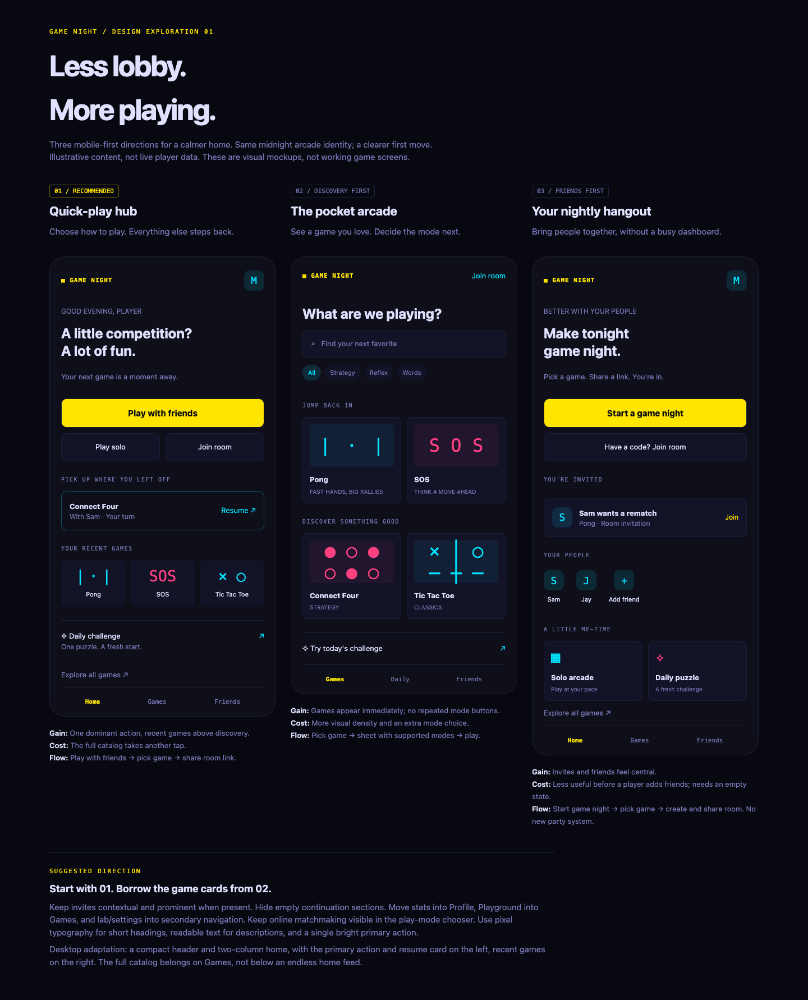
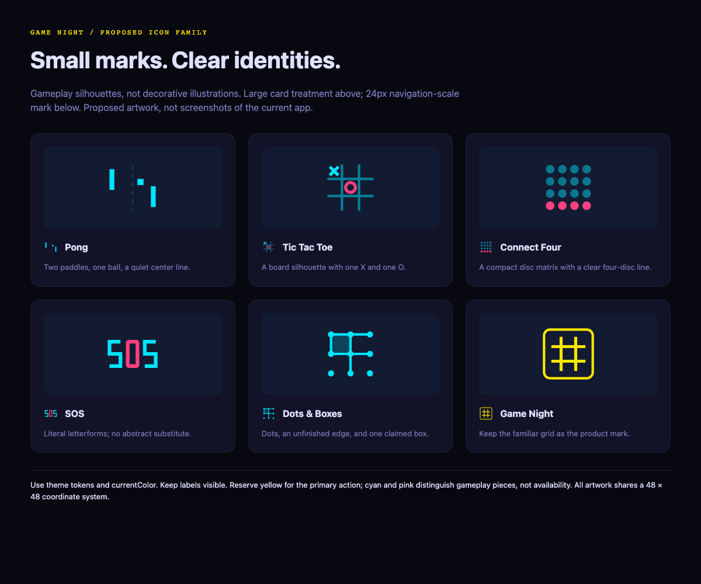

# Home redesign implementation plan

## Status and decision

Approved plan only. The reviewer selected the Quick-play hub and explicitly confirmed that implementation should not begin. No application implementation is included in this change.

Selected in Lavish review: **Concept 01: Quick-play hub**. Adopt this direction, borrowing the visual game-card treatment from Concept 02. The home screen should answer “How do you want to play?” rather than present every destination simultaneously. Preserve the midnight arcade identity, existing themes, anonymous access, and all supported game modes.

The screenshots below are browser captures of proposed HTML mockups, not screenshots of implemented React screens. Their sample invitations and player names are illustrative. The logo reference supersedes the text-symbol placeholders in the home exploration.

## Visual references

### Home direction and alternatives



Editable reference: [home-concepts.html](home-concepts.html).

### Proposed game logos



Editable reference: [game-logo-direction.html](game-logo-direction.html).

Use these as artwork specifications, not raster assets to ship. Implement reusable SVGs so icons remain sharp and theme-aware.

## 1. Problems to solve

The inspected `src/pages/Home.jsx` combines a large brand block, invitations, daily challenge, join-code entry, online matchmaking, first-run guidance, continuation, the full catalog, recent games, solo discovery, Playground, statistics, leaderboard, and upgrade messaging.

This causes several specific problems:

- Multiple bright calls to action compete before the user sees games.
- Recently played appears after the full catalog.
- Repeated solo and multiplayer entry points add scanning cost.
- Statistics and secondary destinations interrupt the play funnel.
- Home duplicates branding already owned by the shared navigation.

Important existing behavior: `GameOptionsSheet.jsx` already provides grouped mode selection, and its comments document that a catalog card opens the sheet rather than silently creating a room. Reuse this work; do not introduce a second chooser. `RecentlyPlayed.jsx`, however, currently invokes its `onSelect` callback directly, so its integration needs explicit attention.

## 2. Scope and exclusions

### Included

- Compact home with one primary play action, contextual invites and continuation, recent games, and a quiet daily entry.
- A dedicated `/games` catalog destination.
- Consistent navigation and supported-mode selection.
- A reusable visual treatment for existing game icons.
- Accessible mobile and desktop layouts.
- Preservation of room creation, joining, authentication, presence, and deep links.

### Excluded

- New party/lobby infrastructure or multi-room game nights.
- Firebase schema/rules changes.
- New matchmaking algorithms, games, recommendations, or analytics services.
- Rewriting game logic, transport, statistics, or identity.
- Rebranding every game in the first release.
- Changing in-room game switching just to support the new catalog.

## 3. Final home hierarchy

Use this order on mobile:

1. **Shared header:** Game Night mark, Profile entry, and existing settings access. Remove the large duplicate Home logo block.
2. **Contextual invitation:** If there are invitations, show the newest with Join and Dismiss, plus an expandable remaining count. Never silently discard others.
3. **Compact play introduction:** One short heading and supporting sentence, not a full-height hero.
4. **Primary action:** “Play with friends.”
5. **Secondary actions:** “Play solo” and “Join room.” Keep a quiet, explicit “Find an opponent” link to `/online` so public matchmaking remains discoverable.
6. **Continue playing:** Render only when valid resumable rooms exist. Show opponent and turn state only when known.
7. **Recently played:** Up to three games on mobile and four on desktop. Keep visible labels and open the existing mode sheet on selection.
8. **Daily challenge:** One low-emphasis row using the existing DailyTile data and behavior.
9. **Explore all games:** Link to `/games`.
10. **Shared navigation:** Home, Games, Friends; Profile remains reachable from the header. Daily remains accessible from Home and its existing URL.

Do not duplicate the tab bar within Home. Preserve existing Notes and other secondary destinations through Profile/settings navigation rather than removing their routes.

### Empty and exceptional states

- New visitor: omit Recent and Continue; show up to three deterministic starter games derived from valid registry entries. Do not fabricate activity.
- No friends: the primary flow still works by sharing a room link; adding friends is optional.
- Multiple active games: reuse continuation behavior and provide a count/expansion if necessary; do not lose room access.
- Configuration or connection failure: preserve explanatory errors and disable only actions requiring connectivity.
- Anonymous user: no login wall; move upgrade messaging to Profile or an unobtrusive contextual message.
- Long names: wrap or truncate with accessible full names without shrinking actions below 44px.

## 4. Navigation and action contracts

| Entry | Destination or behavior | Required invariant |
| --- | --- | --- |
| Play with friends | `/games?intent=friend` | No room creation merely from entering the catalog. |
| Play solo | Existing `/demo` hub | Keep standalone games and AI-capable games aligned with existing support. |
| Join room | Existing BottomSheet containing the join form | Preserve code normalization, validation, errors, and invite-link behavior. |
| Find an opponent | `/online` | Public matchmaking remains distinct from a private invitation. |
| Recent/starter game | Existing GameOptionsSheet | Do not silently create a Firebase room. |
| Explore all games / Games tab | `/games` | Full categories, filters, variants, and rules remain available. |
| Daily challenge | `/daily` | Preserve challenge/progress behavior. |
| Profile avatar | `/profile` | Stats, leaderboard, account, and secondary destinations remain reachable. |
| Playground | Quiet catalog utility link | Preserve `/playground` without a home-sized promotional panel. |

For friend intent, the catalog should explain “Choose a game to invite a friend.” Selecting a card still opens the existing sheet, where the friend action is primary. Creating a room requires pressing that explicit action. Generic `/games` remains mode-neutral. Browser Back must restore the prior catalog filter/scroll state without creating a room.

Keep `/demo`, `/solo/:type`, `/local/:type`, `/online`, and `/game/:gameId` unchanged. Do not rename game identifiers or storage keys.

## 5. Layout and visual system

### Mobile

- Support 320px through tablet widths without horizontal page scrolling.
- Use 16–20px page gutters and a consistent section spacing scale.
- Keep the primary play action in the first viewport under ordinary conditions; active invitations may intentionally take precedence.
- All controls have at least a 44 × 44px interactive area.
- Place the join-code input in a sheet, not permanently beside Daily.
- Respect safe-area insets and the existing tab-bar bottom padding.
- Use content-driven page height; mockup phone heights are presentation frames, not production constraints.

### Desktop

- Use the existing wide layout conventions, with approximately a 1040–1120px maximum content width.
- Place the play controls and continuation in the main column; recent games and Daily in the secondary column.
- Keep invitation content above the two-column split.
- Let Games own the multi-column catalog; do not reintroduce the full catalog below Home.
- Ensure the global header width aligns with the new page container rather than leaving it constrained to a phone-width center strip.

### Typography and color

- Keep the product's selected pixel/display font for short headings and game names; respect ongoing font-preference work.
- Use existing readable body typography for descriptions and forms, preferably 14–16px rather than tiny all-caps paragraphs.
- Use `--c-*` variables and semantic Tailwind tokens exclusively in application components.
- Reserve CTA color and glow for the main action. Use quiet surfaces and borders elsewhere.
- Check normal text contrast at 4.5:1 and UI boundaries/focus at 3:1 where required; the concept palette is not a substitute for an accessibility audit.
- Preserve reduced-motion settings and avoid ambient animation in the initial scope.

## 6. Game-logo specification

### Shared construction

- Keep `src/components/GameIcons.jsx` and the registry's `Icon` references as the source of game identity.
- Existing icons use a 24px coordinate system. Preserve that API; normalize new artwork to 24 units or use an internal 48-unit viewBox without changing caller sizing.
- Use 24px in compact rows, 32–40px in recent cards, and 64–80px within catalog artwork panels.
- Keep a visible name beside/below every icon; icons are decorative with `aria-hidden` when the label already names the game.
- Use `currentColor` for the primary shape and theme-token styles for an optional second gameplay color. No fixed cyan/pink SVG attributes.
- Use stable geometric strokes and avoid text glyphs/emoji for essential silhouettes.
- Show selected, hover, focus, loading, and disabled states through the card controls, not by changing the game identity.
- Do not use color alone to convey selected modes, availability, or players.

### Individual marks shown in the screenshot

| Game | Shape | Preserve at small sizes |
| --- | --- | --- |
| Pong | Opposed paddles, square ball, understated center line | Paddles and ball remain visible; center line can disappear at 24px. |
| Tic Tac Toe | Board grid, one X, one O | Cross and ring remain distinct; no complete-board illustration needed. |
| Connect Four | Compact disc matrix with a four-disc run | Round discs and the line of four; this is symbolic, not a literal board-size diagram. |
| SOS | Three deliberately drawn letterforms | Both S shapes face correctly; O must read as a letter, not an unexplained dot. |
| Dots and Boxes | Dot lattice, connected edges, one claimed square | Distinguish dots from strokes and keep the square recognizable. |
| Game Night | Existing grid mark within a compact tile | Retain the existing brand instead of introducing a competing logo. |

First release: update these representative games only if approved, then apply a consistent wrapper to the remaining existing icons. Do not block the home redesign on dozens of bespoke illustrations. Variants inherit their parent mark and retain their variant label.

## 7. File-level implementation sequence

### Phase A — Establish the catalog destination

1. Add `src/pages/Games.jsx`, importing the existing GamePicker rather than duplicating its filters/cards.
2. Add `/games` to `src/App.jsx` and meta-route navigation handling in `NavBar.jsx`.
3. Inspect Home's full room-creation callback and dependencies before moving it. Since Home no longer owns the full picker but still has recent-game actions, share creation through the narrowest existing abstraction; if none exists, extract a small hook such as `useCreateGame`, keeping its Firebase writes unchanged.
4. Pass the existing online, solo, local, rules, and variant callbacks through unchanged.
5. Preserve catalog scroll/filter persistence, moving Home-specific restoration only where it actually belongs.
6. Verify direct entry to `/games`, history navigation, and friend-intent query handling.

**Exit condition:** All current catalog actions work on `/games`; no duplicate room creation implementation.

### Phase B — Compose the quiet Home

1. Remove the full catalog, repeated solo promotion, Playground promotion, statistics block, and oversized logo from Home.
2. Reuse `ContinuePlaying`, `RecentlyPlayed`, `DailyTile`, `Avatar`, and existing invite data subscriptions.
3. Add the compact primary/secondary play controls and quiet online link.
4. Reuse BottomSheet for Join room; preserve current code parsing/navigation logic.
5. Make recent cards open GameOptionsSheet. Normalize missing or removed game types before rendering saved recents.
6. Keep configuration warnings, onboarding gating, invitation dismissal, and identity handling functional. Replace duplicated “how it works” prose with concise guidance only after checking existing onboarding persistence.
7. Relocate statistics, leaderboard, and upgrade messaging without duplicating subscriptions or removing existing access.

**Exit condition:** Home has no full catalog and no repeated primary promotions; returning and first-time visitors each have a complete play path.

### Phase C — Navigation and responsive polish

1. Update `BottomTabBar.jsx` and `TAB_BAR_ROUTES` together for Home/Games/Friends.
2. Keep Profile directly reachable in the shared header; preserve settings controls and secondary links.
3. Retain game-room and Playground header exclusions and the existing leave-match interception behavior.
4. Align desktop container widths and safe-area padding.
5. Check sticky catalog controls against `--app-header-offset` and hide-on-scroll behavior.

**Exit condition:** There is exactly one shared header and one applicable tab bar; no room UI gains unwanted chrome.

### Phase D — Cards and SVG assets

1. Reuse GameCard and registry Icon values; introduce at most a small shared artwork wrapper if repeated styling warrants it.
2. Add a compact presentation variant only where needed, preserving existing GameSwitcher callers.
3. Apply the approved sample icon treatment to the representative marks.
4. Validate all theme and font settings at compact and catalog sizes.
5. Replace mockup glyph placeholders with actual SVG references when capturing implementation screenshots.

**Exit condition:** Visual identity is consistent without a parallel game registry or per-page icon map.

## 8. Interaction, accessibility, and async requirements

- Retain the project's `useBusy()` convention for asynchronous room creation and other applicable actions: immediate lock, disabled control, progress label, and recoverable toast errors.
- Prevent double submission across all entry points while a room is being created.
- Sheets must have accessible names, focus containment, Escape dismissal, and focus restoration to the initiating control; verify the existing BottomSheet behavior instead of assuming it.
- Join-code inputs need visible labels, suitable capitalization, Enter submission, and errors announced accessibly.
- Navigation uses links; actions use buttons. Avoid nested interactive controls in cards.
- Keyboard focus order follows the visible content hierarchy.
- A failed invitation dismissal or stale room must not masquerade as a successful join.
- Respect game capability checks such as `supportsLocalPlay` and existing solo/multiplayer metadata. Never show every mode for every game.

## 9. Verification plan

### Automated baseline and regression checks

Run before application changes and after each implementation phase:

```sh
npm test
npm run lint
npm run build
```

Record baseline failures separately, especially because the working tree currently includes unrelated ongoing changes. Do not treat existing lint/build failures as redesign regressions without checking the baseline.

Existing tests cover pure logic, not the UI flows below. If new pure helpers are introduced for recent-game normalization or intent handling, add colocated tests. Do not claim full UX verification from the existing test suite alone.

### Manual acceptance matrix

- First visit: no fabricated recent games, no login requirement, starter cards open supported-mode selection.
- Returning player: recents appear before discovery; removed registry IDs do not crash the page.
- Active room: Resume reaches the correct room and preserves seat reclamation.
- Invitations: zero, one, and several invitations; both Join and Dismiss remain reachable.
- Friend flow: Home → Games → game → explicit friend action → room → share link.
- Online flow: Home link and game-specific sheet both reach the appropriate lobby.
- Solo/local: supported entries work; unsupported modes are absent.
- Join: valid code, empty/invalid code, missing room, Enter submission, and network failure.
- Repeated tap: only one room is created.
- History: catalog filters and scroll behave correctly after returning from a sheet or room.
- Keyboard: navigation, cards, sheets, focus restoration, and visible focus indicators.
- Viewports: 320, 390, 768, 1024, and 1440px; no page-level horizontal overflow; no fixed-navigation overlap.
- Themes: midnight, phosphor, amber, synthwave, grid, and mono; verify contrast and two-tone icon legibility.
- Preferences: large text/200% zoom, reduced motion, and current font settings.
- Two-player smoke test: use separate browser profiles/devices, not ordinary same-profile tabs. Verify one turn-based room and Pong signaling/gameplay remain unaffected.

Capture actual implementation screenshots at 390px and 1440px, plus logo samples at 24px and 64px in at least midnight and mono. Keep proposal images labeled as proposals rather than replacing evidence silently.

## 10. Rollout and rollback

Implement in reviewable commits: catalog route, Home composition, navigation, then artwork/polish. Avoid touching Firebase or game logic. Preserve direct routes throughout so rollback consists of reverting the UI commits rather than migrating user data.

The current worktree contains unrelated modifications to navigation, typography, settings, and other components. Re-read those files at implementation time and coordinate with that work; never overwrite or revert it to match this plan's earlier snapshot.

## Definition of done

- One primary Home action and clearly discoverable solo, join, and online alternatives.
- Recent and resumable games precede discovery.
- Full catalog lives on Games, with all current capabilities preserved.
- Stats, Profile, Daily, Playground, leaderboard, and settings remain reachable.
- Shared navigation is not duplicated.
- SVG game marks remain recognizable, labeled, and theme-safe.
- Manual acceptance matrix is complete, and test/lint/build results are documented.
- No database migration, game-rule change, or unrelated cleanup was required.

Stop at the detailed plan and attached visual references until application implementation is explicitly requested.
