# PRD — Archery (draw, aim, loose)

**One-liner:** turn-based target archery. Press on the bow, pull back to draw, slide to aim,
then lift to loose. Wind and distance change every end, and the highest total wins. It is
built portrait-first for a phone thumb and plays solo, pass-and-play for 2–4 on one device, or
online for 2–4. Online sync reuses Artillery's deterministic replay: one small write per arrow,
with no WebRTC.

| | |
|---|---|
| `type` | `archery` (2P room) + `archery4` (2–4 party room, `variantOf: 'archery'`) |
| Label / badge | `ARCHERY` / `AC` · `ARCHERY 4P` / `AC4` |
| Category | `reflex` (aim skill), turn-based mechanics |
| Integration | **C**: custom pages (2P room page, 4P party page, solo demo, local page) |
| Network | RTDB only, using the deterministic replay model from [artillery.md](artillery.md) |
| Effort | **L**: about 7–9 dev-days in 4 phases (P1 is shippable alone) |
| Priority | P2 |

Inspired by the Archery mini-game in *2 Player Games: Offline Games* (Moreno Maio). The name,
art, rules text and tuning in this PRD are our own. This PRD was written from the
games-archery-design-s1 design pass, whose interactive board has clickable mockups of all three
UI directions and a canvas prototype of the gesture. Everything marked **pending captain** is a
recommendation that has not been approved yet.

## Game rules

- **Match (STANDARD, the default):** 4 ends × 3 arrows per archer at 18 → 30 → 50 → 70 m, for a
  maximum of 120 points. The host or setup screen can also pick QUICK (3 × 3 at 18/30/50 m, max 90)
  or MARATHON (6 × 3 at 18/30/40/50/60/70 m, max 180).
- **Face:** the real World Archery 122 cm 10-ring face. Rings are 6.1 cm wide, and the X ring
  has a 3.05 cm radius. The zones are gold (X, 10, 9), red (8, 7), blue (6, 5), black (4, 3) and
  white (2, 1). Off the face scores M (0).
- **Line-cutter rule:** an arrow touching a line scores the higher ring (hit radius < ring
  radius + 0.4 cm shaft). X counts 10 and is the first tie-break stat.
- **Turn rhythm** (D1, pending captain): each archer shoots a full end of 3 arrows, then the next
  archer shoots. From end 2 on, the lowest running total shoots first.
- **Win:** highest total after the last end. The results screen ranks 1–4, and the room winner
  gets `scores[w] + 1` as in every other game.
- **Ties** (D8, pending captain): most X's wins. If still tied, a one-arrow shoot-off at 70 m
  decides it, closest to centre (compared as exact distance², so it is deterministic). A tied
  shoot-off repeats.
- Match length is about 2 min solo, 3 min for 2P and 6 min for 4P (STANDARD).

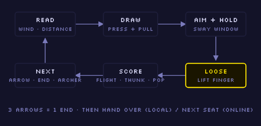

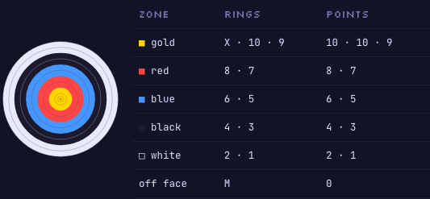

## Aim and release (the gesture)

The view is first-person, looking down the range: the target is in the top half, and the bow
sits in the bottom third within thumb reach. One continuous gesture sets power, direction and
timing.

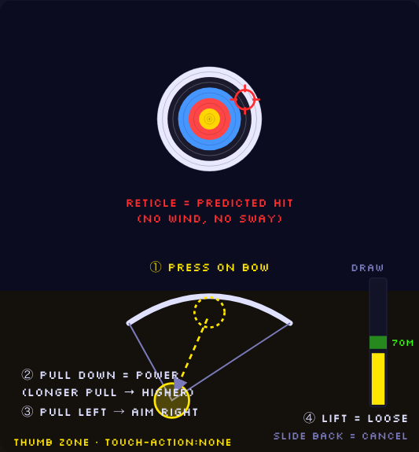

1. **Press** within 70 px of the bow grip (bottom centre, at least 96 px above the home
   indicator). The range uses `setPointerCapture`, `touch-action: none` and
   `overscroll-behavior: none` so that iOS scroll, pull-to-refresh and edge-back never steal the
   draw.
2. **Pull down = power.** Draw = pull length / 200 px, clamped to 0–1. Each distance has an
   ideal draw, shown as a green **sight band** on the draw meter: 18 m ≈ 55 %, 30 m ≈ 65 %,
   50 m ≈ 75 %, 70 m ≈ 85 %. Pulling past the ideal lifts the aim point and pulling short drops
   it (2.2 px of reticle per px of pull). Power therefore maps to height on the target, and one
   gesture carries power and angle (D6, pending captain).
3. **Pull sideways = direction.** The horizontal offset × −0.9 moves the reticle, mirrored like
   a slingshot: pull left to aim right.
4. **Lift = loose,** on pointerup or pointercancel. The final aim, including the current sway
   offset, is sampled on that frame.
5. **Cancel:** releasing below 30 % draw, or sliding back onto the grip, cancels the shot. No
   arrow is spent, the string relaxes and a soft click plays.
6. **Reticle:** shows the predicted hit with no wind and no sway. It is hidden for you on ROBIN
   HOOD difficulty.
7. **Keyboard:** hold SPACE to draw (power rises 60 %/s), use the arrow keys to fine-aim, and
   release SPACE to loose. Keys go through `useGameKeys`, never a raw window listener, because
   the room chat shares the page.

### Steadiness sway (local only; D5, pending captain)

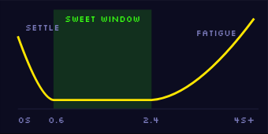

- The reticle drifts on a readable two-sine figure-8, not random jitter.
- **Amplitude over hold time:**
  - 0–0.6 s: *settle*, large and shrinking.
  - 0.6–2.4 s: *sweet window*, small.
  - After 2.4 s: *fatigue*, growing fast. A heartbeat thump plays after 4 s.
- The amplitude also scales with draw (a full draw shakes more) and with distance.
- Sway is never synced: it is already baked into the recorded aim, and opponents never see it.
- A **STEADY AIM** assist in settings multiplies sway by 0.4. The results screen then marks the
  game "ASSIST".

### Wind and distance

- **Wind per end:** a base crosswind of −5…+5 m/s, plus a per-arrow gust of ±0.8 m/s. Both come
  from `mulberry32(seed ^ index)`, so every client knows the wind before the shot. The HUD shows
  a direction arrow and speed, for example `→ 3.2`.
- **Drift** = 6 cm × wind × flight time, where flight time = distance / (40 + 30 × draw) m/s.
  At 70 m in a 4 m/s wind that is about 24 cm (4 rings); at 18 m it is about 6 cm. A fuller draw
  flies faster and drifts less, which is the reason to pull hard.
- **Face size on screen** = 150 px × (18 / D)^0.45, with a minimum radius of 70 px:

  | Distance | Face radius |
  |---|---|
  | 18 m | 150 px |
  | 30 m | 119 px |
  | 50 m | 94 px |
  | 70 m | 81 px |

  Difficulty comes from drift, the draw band and sway, not from tiny pixels.

### Deterministic shot core

```js
// archeryLogic.js — the only maths every client must agree on.
// + − × ÷ on integer inputs only: bit-identical on every engine.
export function resolveShot({ ax, ay, dr }, { distance, wind }) {
  // ax, ay: aim in MILLIMETRES on the face (ints, sway already applied)
  // dr: draw in per-mille (300..1000, int)
  const v = 40 + 30 * dr / 1000            // m/s
  const t = distance / v                   // s
  const x = ax + 60 * wind * t             // mm, +x = right (drift)
  const y = ay                             // elevation is baked in by the pull
  const r2 = x * x + y * y
  return { x, y, r2, ring: ringFor(r2) }   // ringFor compares r² to radii² (no sqrt)
}
export function ringFor(r2) {
  const R = r => (r + 4) * (r + 4)         // 4 mm line-cutter
  if (r2 <= R(30.5)) return 'X'
  for (let k = 10; k >= 1; k--) if (r2 <= R(61 * (11 - k))) return k
  return 'M'
}
```

The design pass included a throwaway canvas prototype of the gesture, restyled to direction A. The screenshot below shows it; it is not production code.

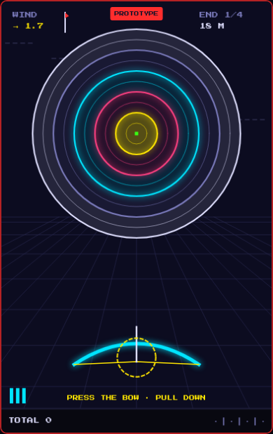

The flight animation is cosmetic (it may use `Math.sin`) and is driven by the resolved impact.
It lasts 380–650 ms, longer at range. The arrow sprite scales 1.0 → 0.12 along a shallow arc and
curves with the wind, then sticks with fletching in the archer's colour and glyph, and a score
number pops up.

## Modes

### Solo (`/solo/archery`, `ArcheryDemo.jsx`)

**VS CPU:** you and a CPU alternate ends. The CPU uses the P2 seat colour and gets a visible
"CPU AIMS…" draw beat. The CPU is a pure seeded function,
`botShot(seed, index, level, distance, wind)`. Its aim error scales with distance / 70, and it is
unit-tested per level.

| Level | Aim σ | Wind-read error | Reticle |
|---|---|---|---|
| ROOKIE | 14 cm | ±60 % | on |
| CLUB | 8 cm | ±30 % | on |
| PRO | 4.5 cm | ±12 % | on |
| ROBIN HOOD | 2.5 cm | ±5 % | **off for you** |

**SCORE ATTACK:** play alone to beat your personal best.
- Shows a per-end personal-best ghost line ("+4 vs PB").
- End-of-match rank badge: BRONZE 70, SILVER 90, GOLD 105, X-MASTER 115 (STANDARD).
- The PB is stored in localStorage as `archery-pb-{format}`, wrapped in try/catch.

**Later (D9, pending captain):** DAILY RANGE, a shared seed from `daily.js` `todayKey()` so
everyone faces the same wind, which lets players compare scores.

### Same device, 2 / 3 / 4 (`/local/archery`, `ArcheryLocal.jsx`)

- **Setup:** pick the player count, edit names and drag to reorder the shooting order.
  - Each seat has a fixed colour and glyph: P1 ● `--c-p1`, P2 ▲ `--c-p2`, P3 ■ `--c-p3`,
    P4 ◆ `--c-p4`.
  - P1 defaults to your profile name and avatar; the others start as "PLAYER N" with guest
    avatars.
  - There is no Firebase.
- **Handoff:** a full-screen card between archers ("PASS TO ▲ MAYA", plus distance, wind and the
  gap to the leader). The next archer taps READY to start their end, which stops a stray touch
  from firing their first arrow. There is no hidden information, so there is no "look away" step.
- **Scoreboard:** up to 4 seat chips are always visible, and a tap opens the end-by-end card.
- **Registry change needed:** `supportsLocalPlay()` (`src/lib/games.js:1574`) excludes `custom`
  games. Add an additive registry hook `LocalPage: lazyWithRetry(...)` that
  `supportsLocalPlay` and the `Demo.jsx` local dispatcher honour. This is the only shared-code
  change.

### Online (2–4)

Two entries, one engine, following the Chain Reaction / Chain Reaction 4P precedent (D2,
pending captain):

- **`archery`** is 2P on the standard X/O room. It gets:
  - public PLAY ONLINE matchmaking (non-race nPlayer rooms are excluded, see
    `src/lib/matchmaking.js:10`)
  - the first-mover picker (`usesFirstMover`, `games.js:1565`)
  - spectators via `SpectatorCard`
  - the PLAY AGAIN / SWITCH GAME proposal handshake
  - CLAIM WIN on abandon
  - leaderboard credit
- **`archery4`** is a 2–4 party room (`nPlayer: true, minPlayers: 2, maxPlayers: 4`):
  - lobby → host START
  - colours dealt by join order X O A B → P1–P4
  - the online-aware coordinator (`isRoomCoordinator`) for START and NEW MATCH
  - away-turn skipping
  - The wiring is copied from `ChainReaction4Game.jsx`.
- Both render the same `ArcheryRange` and `archeryLogic`; only a seat adapter differs.

**Why not the WebRTC (Pong) path:** Archery is turn-based with one event per arrow. RTDB latency
(100–300 ms) hides behind the ~500 ms flight animation, and RTDB gives spectators, reconnect and
persistence for free. There is also no NAT/TURN risk. **Optional later:** a live "▲ MAYA IS
DRAWING…" indicator via one `archeryDrawing` flag per shot (two writes), not a stream.

## The sync model (seed + shot replay)

```
games/{gameId}
  gameType: 'archery' | 'archery4'
  status, currentTurn ('X'|'O'|'A'|'B'), players, scores, …   // existing room keys
  archerySeed:   1839204771            // FIELD_NULLS · new per match
  archeryFormat: 'standard'            // FIELD_NULLS · host pick, kept on PLAY AGAIN (like pongMode)
  archeryOrder:  ['X','O','A']         // FIELD_NULLS · seats in shooting order (4P)
  archeryShots:                        // FIELD_NULLS · append-only
    -Nx1…: { by:'X', ax:-37, ay:112, dr:842 }   // ints: mm, mm, per-mille
  archeryDrawing: 'O'                  // optional juice flag, cleared on loose
```

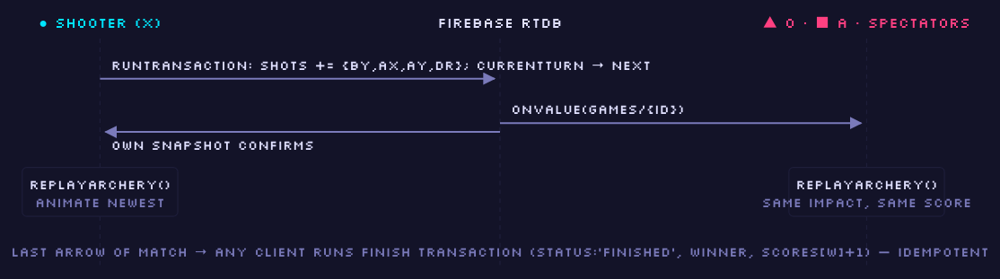

- **Replay:** every client runs `replayArchery(seed, format, order, shots)`, which returns
  arrows, the per-end table, totals, the next shooter and the winner. It runs on every snapshot
  and takes under 1 ms for about 72 arrows.
- **Integers only** in the payload, so JSON round-trips are exact. The maths is + − × ÷ only,
  which is Artillery's contract (`src/lib/artilleryLogic.js:1-10`).
- **One transaction per arrow:** the shooter appends the shot *and* advances `currentTurn` in one
  `runTransaction`. This is the lesson in `ArtilleryGame.jsx:111`. The transaction body
  re-checks seat and turn, so a stale double-tap is a no-op.
- **Finish:** an idempotent transaction by whichever client first sees the replay complete
  (`status: 'finished'`, `winner`, `scores[w] + 1`).
- **Animate only the newest arrow** when it arrives (`lastCountRef`). Read records through a ref,
  so unrelated room writes (chat, presence) don't cancel the flight, as fixed for Artillery in
  2c8f0bc.
- **Disconnects:**
  - When the shooter goes offline, the presence banner shows "▲ MAYA RECONNECTING…".
  - After `CR4_OFFLINE_GRACE_MS` (15 s), any seated client may skip the rest of that archer's
    end as M, inside a transaction (`skipAwayTurn` pattern).
  - When they return, they rejoin at their next end.
  - 2P rooms also keep WAIT / CLAIM WIN.
- **Shot clock:** 30 s per arrow online (the host can turn it OFF), measured with
  `useServerClock`, never `Date.now()`. On expiry the coordinator records an M. There is no
  clock locally.
- **Spectators** see the same replay. Joining mid-match replays instantly and animates only the
  newest arrow. `SeatOffer` lets them take an empty seat between matches.
- **Leaderboard (phase 4):** a `functions/` VERIFIER can replay the shots to confirm the winner
  before crediting. That is stronger than the trust credit custom games get today. Aim itself
  stays client-authoritative, the same honest-client tier as Artillery.

## UI directions (D0, pending captain; A recommended)

The first design round was rejected for looking "off", with soft gradients, a photo-real target
and lowercase mono copy. The real app uses:
- flat `--c-deep` arenas with a thin border
- neon glow objects that scale with `--glow`
- Press Start 2P caps for every label, with mono only for short sentences
- pixel-sprite avatars (`avatarSprites.js`)
- square ‖ / ✕ icon buttons (the Pong full-screen frame)
- a scan-lined CTA
- CRT scanlines on dark themes

The three directions below all follow those rules. Each specifies the same six screens.

The screenshots are 390 × 844 exports of the design board mockups in the MIDNIGHT theme, with the direction A aim and results screens also shown in MATCHA, the app default.

### A · NEON RANGE (recommended)

A Pong-family immersive cabinet, which fits the siblings players already know (Pong, Air Hockey,
Sumo full-screen).

| Screen | Spec |
|---|---|
| Mode picker | "PLAY SOLO" setup card like Pong's: small neon target and chip grids for MODE (VS CPU · SCORE ATTACK), BOT (ROOKIE/CLUB/PRO/ROBIN) and FORMAT (QUICK/STANDARD/MARATHON). Selected = CTA border + tint + glow. A full-width scan-lined **PLAY FULL SCREEN** CTA and a one-line hint. Room entry keeps the existing `GameOptionsSheet`. |
| Aim HUD | Full-screen `--c-deep` arena with a thin border. **Top strip:** rival sprite + "▲ MAYA · 024" in P2, then "END 2/4 · 30M", then ‖ and ✕ square buttons. Synthwave perspective floor grid, and dashed wind streaks with "WIND → 3.2". **Neon target:** ring strokes in theme accents (gold→`--c-cta`, red→`--c-p2`, blue→`--c-p1`, black→`--c-dim`, white→`--c-text`) with low-alpha fills and a `--c-win` X pixel. Stuck arrows carry seat-colour fletching. A neon bow in the seat colour with a blinking dashed grip square. A 10-segment **LED draw meter** hugs the right edge. **Bottom strip:** your sprite + "● YOU · 027" + 3 arrow pips, and the hint "PRESS BOW · PULL · RELEASE". |
| Bow drawn | String pulled to the finger. A square danger-colour crosshair with glow and its dotted figure-8 sway path. LED segments light in CTA, and the sight-band segment is outlined in `--c-win` and turns green when lit. The label cycles SETTLING… → "STEADY · LOOSE NOW" (win, blinking) → "ARM TIRING!" (danger). DRAW % sits beside the meter. |
| Turn handoff | Black screen with the next seat's large sprite, "PLAYER 2", and a big glowing name. Context line: distance, wind, gap to the leader. A seat-tinted bordered "TAP TO DRAW" button (blinking). |
| End scoreboard | The arena dims to 90 % `--c-deep`. "END 2 COMPLETE" and three glowing ring-coloured value boxes (9 · X · 7). "END 26 · TOTAL 053". A **— STANDINGS —** arcade table (1ST/2ND/3RD, glyph + name, dotted leaders, zero-padded totals in the seat colour). CTA "NEXT: ▲ MAYA". |
| Results | **HIGH SCORES** title with the podium sprites (winner larger), a rank table with X counts and 3-digit totals, and a blinking "★ NEW PERSONAL BEST ★". CTAs: PLAY AGAIN (scan-lined), SWITCH GAME and SHOT REPLAY (every arrow is replayable because the shot list is the state). |

| Mode picker | Aim HUD | Bow drawn | Turn handoff | End scoreboard | Results |
|---|---|---|---|---|---|
| 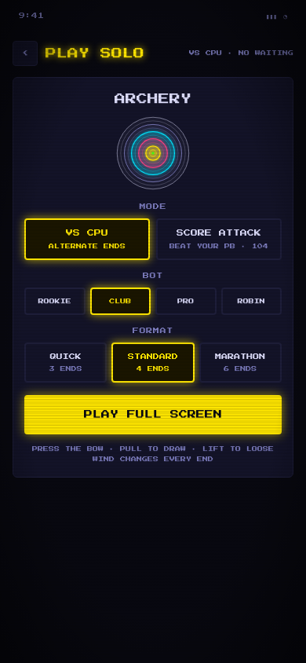 | 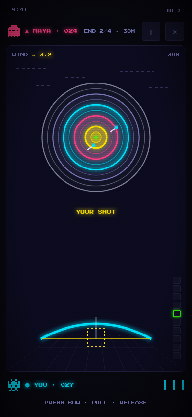 | 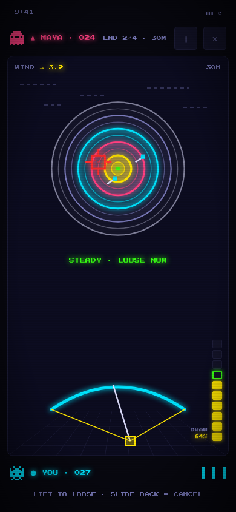 | 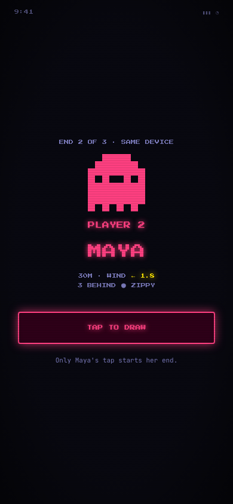 | 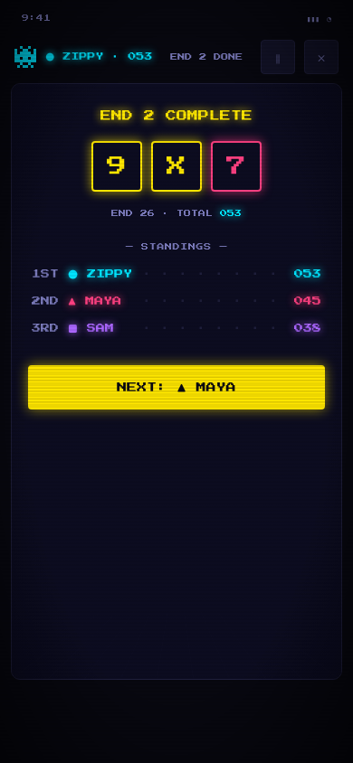 | 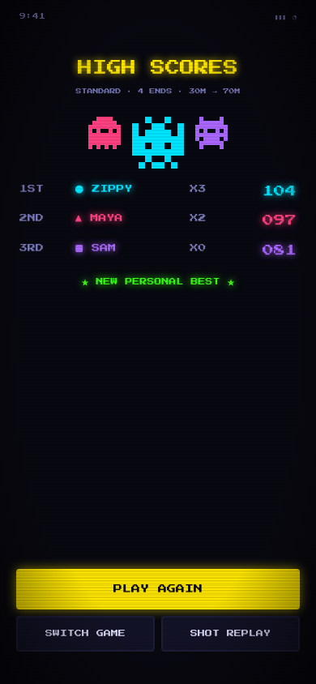 |

| Aim HUD (MATCHA) | Results (MATCHA) |
|---|---|
| 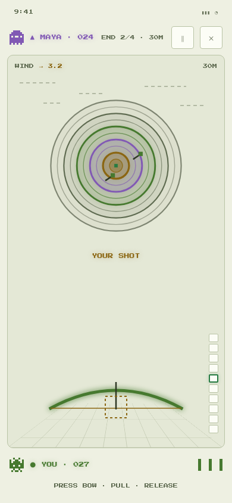 | 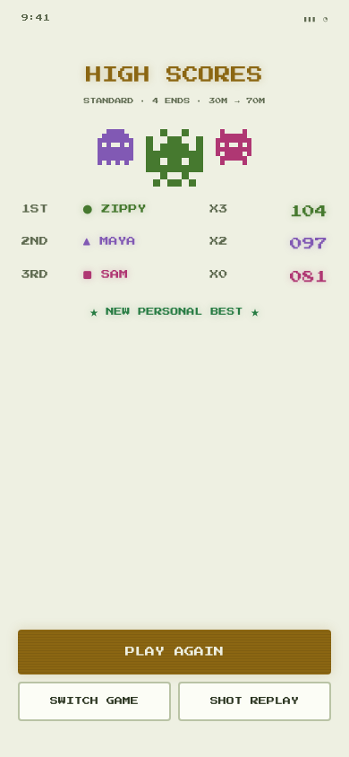 |

- **Themes:** strokes come from `--c-*` only, so the design re-skins across all 16 themes. It
  reads as neon in MIDNIGHT and SYNTHWAVE and as ink-line art in MATCHA.
- **Cost:** lowest, since it is canvas strokes with no sprite art.
- **Risk:** the rings are theme accents, not real archery colours. The score number shows on
  every hit to compensate.

### B · 8-BIT FIELD (most charm)

An NES / Duck Hunt homage.

| Screen | Spec |
|---|---|
| Mode picker | Title screen: a big pixel "ARCHERY" logo with a hard drop shadow and a stepped pixel target. A double-bordered menu box with a blinking ▶ cursor: 1 PLAYER · CPU / SCORE ATTACK / 2–4 PLAYERS / ONLINE ROOM. Then "PUSH START". |
| Aim HUD | Chunky pixel-art range: sky band, pixel clouds, stepped hills, striped grass bands, a stepped pixel target on a wooden stand, and a pixel windsock with speed. A black NES status bar "1P 027 · 2P 024 · E2 30M" on top, a pixel bow sprite at the bottom, and a footer bar "1P · PRESS THE BOW" with arrow icons. |
| Bow drawn | Bow sprite drawn with the string to a pixel hand, a pixel crosshair, "STEADY!", and a footer power bar "POW ▮▮▮▮▮▮▯▯▯▯". |
| Turn handoff | Full-screen status-bar colour, an archer sprite, "PLAYER 2 / ▲ MAYA", context, and a blinking "PUSH START". |
| End scoreboard | A double-framed box: "END 2", big "9 X 7", and a table 1P/2P/3P with per-end values and totals. "▶ NEXT: 2P MAYA". |
| Results | "WINNER!", a pixel block podium with sprites and pixel confetti, and a menu "▶ PLAY AGAIN / SWITCH GAME / SCORECARD". |

| Mode picker | Aim HUD | Bow drawn | Turn handoff | End scoreboard | Results |
|---|---|---|---|---|---|
| 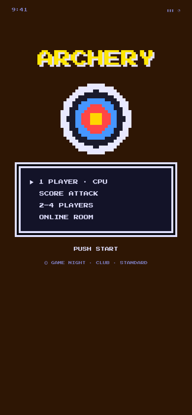 | 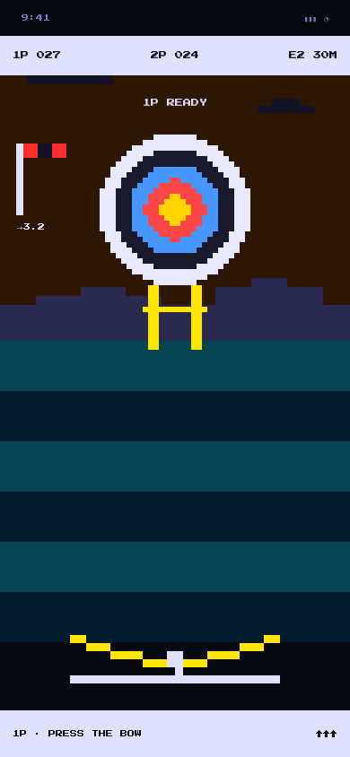 | 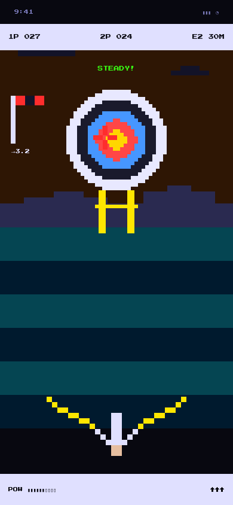 | 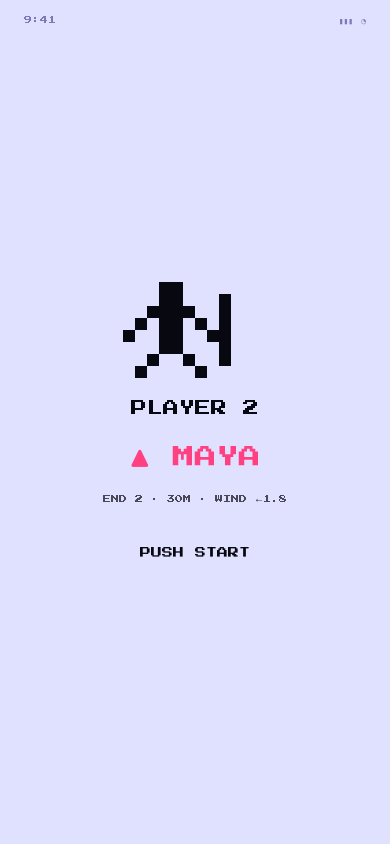 | 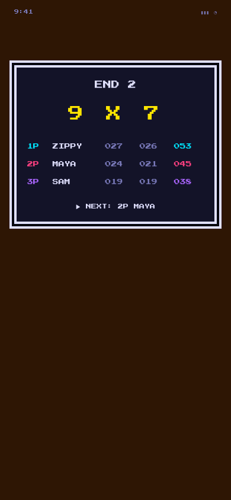 | 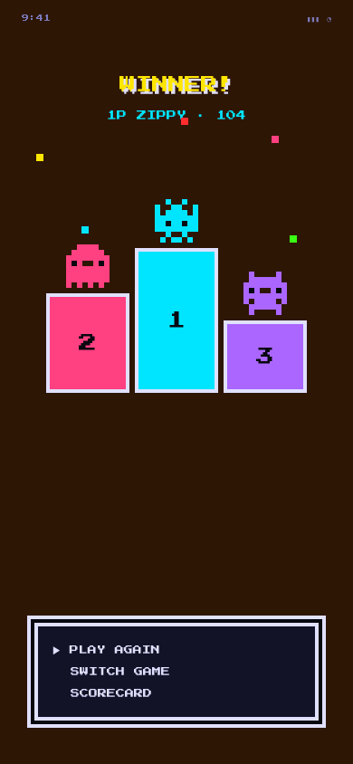 |

- **Cost:** about +2 d of pixel art (target, bow, hands, scenery) and crisp scaling at every DPR.
- **Risk:** big light-sky areas fight dark themes, and 6 px pixels are hard to read on small
  phones. It is the odd one out next to Pong and Arrows. B's pixel target could become a later
  "8-BIT" cosmetic skin on top of A.

### C · CABINET CARD (safest)

Stays inside the standard room page, like Arrows and Artillery.

| Screen | Spec |
|---|---|
| Mode picker | The existing `GameOptionsSheet` bottom sheet: game meta, CREATE ROOM (primary), PLAY ONLINE / PRACTICE VS CPU / SAME DEVICE rows, and a MORE MODES · RULES footer. |
| Aim HUD | Room header (‹, ARCHERY, room code, ⛶, ♪). Player cards like Arrows: seat-colour border and glow on the current turn, total, arrow pips and an end-progress bar. An arena panel (`--c-deep`, 2 px border) with the real-colour target (`--c-ring-*` tokens) and wind and distance. Below it, a **control pad card**: the bow drag area, a horizontal draw bar with the sight band, fine-tune buttons ◀ ▶ − +, and a **LOOSE** button. |
| Bow drawn | A crosshair on the target, the draw bar filled, and "STEADY · DRAW 64%". |
| Turn handoff | A bottom-sheet modal over the dimmed page: seat sprite, "PASS THE PHONE TO ▲ MAYA", context, and a seat-coloured CTA "I'M MAYA · READY". |
| End scoreboard | A card with the three ring-framed values, end total and rank, and a distance-column scorecard table (18/30/50/70/Σ). CTA "NEXT: ▲ MAYA". |
| Results | `RoundEndPanel` style: "● ZIPPY WINS", the full scorecard, the match score line, then PLAY AGAIN / SWITCH / REPLAY / SHARE. |

| Mode picker | Aim HUD | Bow drawn | Turn handoff | End scoreboard | Results |
|---|---|---|---|---|---|
| 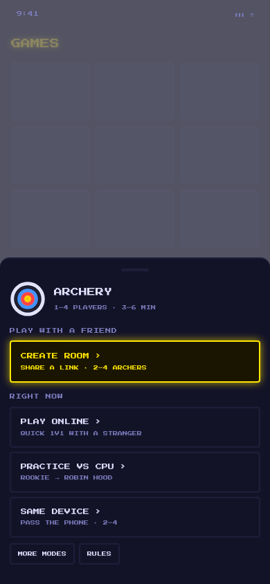 | 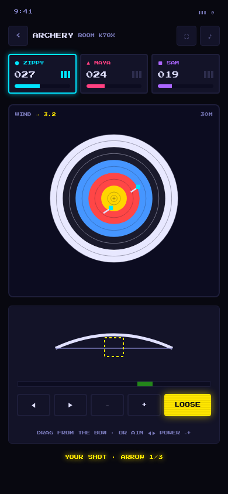 | 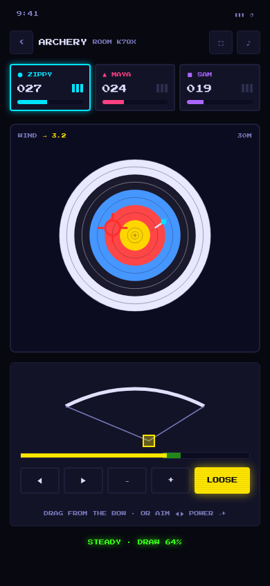 | 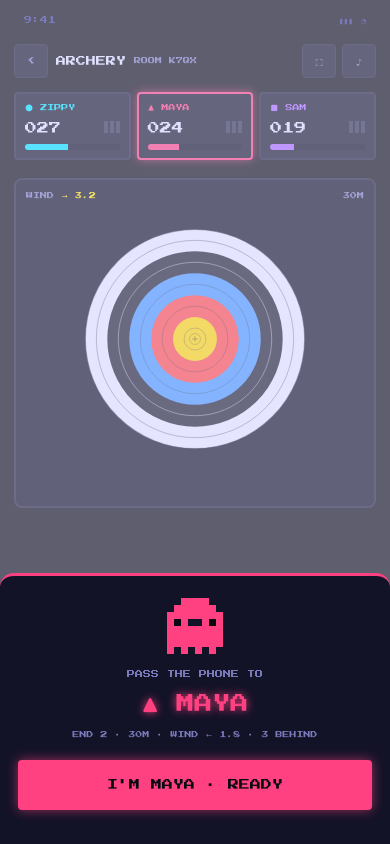 | 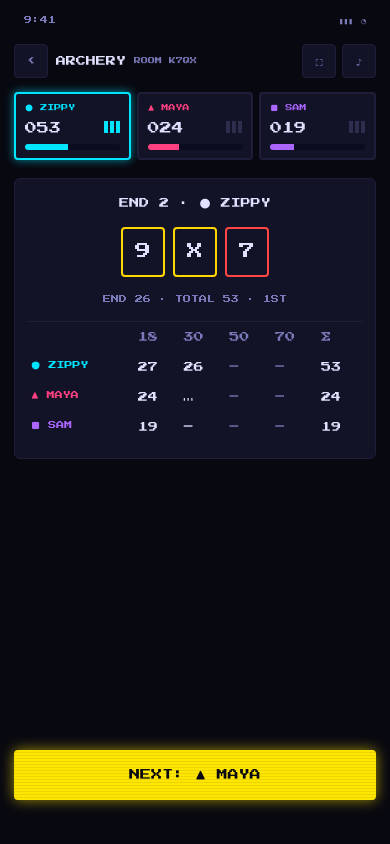 | 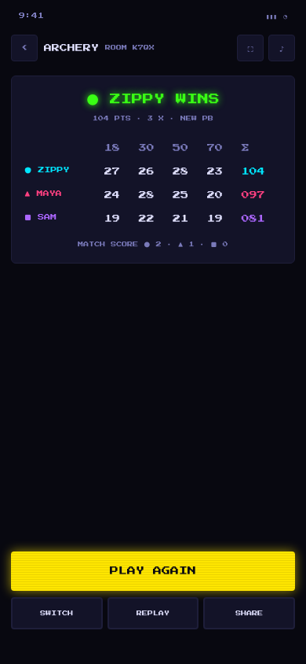 |

- **Strength:** calm and accessible, with buttons backing up the gesture.
- **Weakness:** the gesture is squeezed into a 236 px pad, the target shrinks, and it is the
  least arcade, which is exactly what the captain objected to.

### Landscape, Fill and chrome (all directions)

- **Portrait first.** In landscape the arena takes the left ~70 %, and the rival and you strips
  stack on the right with the LED meter. The pull gesture moves to the right-thumb side.
- **Thumb reach:** everything touched mid-shot sits in the bottom 40 %. Pause and quit sit
  top-right, and the page body scroll locks during a draw.
- **Immersive Fill** (`useImmersive` + `FullscreenToggle`, local commit `424d837`) is **not on
  origin/main**. A is already full-screen. The page root is `flex-1 min-h-0` and the canvas
  measures its container with a `ResizeObserver` (like Pong's `fitCourt`), so it works either
  way.
- **Reused chrome:** `Avatar` sprites, the room header, `EmoteBar` (in the wait state),
  `ConnectionBanner`, `ProposalBanner`, `GameOptionsSheet` and `RoundEndPanel`. There are no
  shared-UI changes.

## Feel: juice, sound, haptics, accessibility

| Moment | Visual | Sound (`sounds.js`) | Haptic | Reduced motion |
|---|---|---|---|---|
| Press bow | grip lights with CTA glow | soft tick | 6 ms | same |
| Drawing | limbs bend, string follows the finger, meter fills | **new** `bowDraw` rising creak, pitch ∝ draw | tick at 25/50/75 %, bump entering the band | same |
| Fatigue > 4 s | wobble grows, vignette pulse | **new** `heartbeat` (80 Hz) | [0,20,120,20] | no vignette pulse |
| Loose | string snap, 6 px bow kick | **new** `twang` (triangle 180→90 Hz) | 12 ms | no kick |
| Flight | arrow scales into the distance, curves with the wind | air whoosh | – | 100 ms fade to impact |
| Hit | 2 px target wobble, stuck arrow, number pop | **new** `thunk`; gold adds an arpeggio | 25 ms · gold [0,30,40,60] | no wobble, static number |
| X / bullseye | gold pixel burst, "X!", low-alpha flash | short `win` motif | [0,40,30,70] | no burst or flash |
| Miss | "M" in dim | reuse `miss` | – | same |
| Match end | podium, `WinEffect` | reuse `matchWin` / `lose` | reuse | `WinEffect`'s own handling |

- **Music:** declare `useMusicScene('game', 'archery')`, plus `'results'` on the results screen.
  The in-game track follows the registry `category` (`musicLogic.js`).
- **Haptics** (D7, pending captain): route every pattern through `sounds.js`'s `vibrate()`, which
  is currently a platform-wide kill switch (`src/lib/sounds.js:28`, "Haptics disabled — keep
  audio, kill vibration"). Archery then lights up when the platform re-enables haptics. Never
  call `navigator.vibrate` directly. iOS Safari ignores it anyway.
- **Colour-blind safe:** seat colour is never the only signal. Every seat carries its glyph on
  chips, fletching, scorecards and handoffs, the same way Chain Reaction 4P uses theme-neutral
  "● P1" labels.
- **Accessibility:**
  - `LiveAnnouncer` reads each arrow, e.g. "Maya, arrow 2, nine. End total 17. Maya leads by 3."
  - Full keyboard play and visible focus.
  - Reduced motion follows `useMotionPref`, where the app setting beats the OS setting.
  - Text is at least 8 px pixel font or 11 px mono, and targets are at least 44 px.

## Decisions (all pending captain; the recommendation is listed first)

| ID | Question | Options | Recommendation |
|---|---|---|---|
| D0 | UI direction | A NEON RANGE / B 8-BIT FIELD / C CABINET CARD | **A** |
| D1 | Turn rhythm | per END (3 arrows) / per ARROW / per end locally + per arrow online | **per END** |
| D2 | Online structure | `archery` 2P + `archery4` 2–4 / single nPlayer entry / 2P-only online | **two entries** |
| D3 | Default length | STANDARD 4×3 + host picker / QUICK / fixed format | **STANDARD** |
| D4 | Scoring face | WA 10-ring + X, line-cutter / simplified 5-zone | **WA 10-ring** |
| D5 | Steadiness sway | on (settle → window → fatigue) + STEADY AIM assist / off by default | **on** |
| D6 | Power model | pull length = power = height / fixed draw, free aim | **pull = power** |
| D7 | Haptics | follow `sounds.js` switch / Archery-only opt-in / re-enable platform-wide | **follow switch** |
| D8 | Tie-break | X count, then shoot-off / shared draw / shoot-off only | **X then shoot-off** |
| D9 | Solo scope at launch | CPU ×4 + Score Attack (Daily later) / + Daily at launch / CPU only | **CPU + Score Attack** |
| D10 | Range rendering | canvas range + DOM HUD / SVG like Artillery | **canvas** |

## Files

**New:**
- `src/lib/archeryLogic.js` + `.test.js`: constants table, `windFor`, `resolveShot`,
  `ringFor`, `replayArchery`, `nextShooter`, `standings`, `tieBreak`, `botShot`. Pure and
  `// @ts-check`.
- `src/lib/archerySway.js` + `.test.js`: local sway curve and the gesture → aim mapping.
  Pure and not synced.
- `src/components/ArcheryRange.jsx`: canvas range (target, arrows, reticle, flight, wind). Reads
  `--c-*` through `getComputedStyle` on theme change. There is no hex anywhere.
- `src/hooks/useBowDraw.js`: pointer events, capture and cancel, plus keyboard via
  `useGameKeys`.
- `src/components/ArcheryScorecard.jsx`: seat chips, the end table (1–4 players) and the HIGH
  SCORES / podium.
- `src/pages/ArcheryGame.jsx`: the 2P room page (Artillery wiring) and the 4P party page (CR4
  wiring) behind a seat adapter.
- `src/pages/ArcheryDemo.jsx`: solo VS CPU and Score Attack, with no Firebase.
- `src/pages/ArcheryLocal.jsx`: pass-and-play 2–4, with setup and handoff.
- `tests/rules/archery.test.js` and `tests/e2e/archery.spec.js` (2P and 3P flows, one browser
  context per player).

**Touched:**
- `src/lib/games.js`:
  - two entries (`archery`, and `archery4` with `variantOf`), each with a lazy `Page`
  - a `freshGameState` branch (seed, format, `currentTurn: 'X'`)
  - four keys added to `FIELD_NULLS`
  - `startRound` for 4P
  - the `LocalPage` hook in `supportsLocalPlay`
- `src/pages/Demo.jsx`: solo card and local dispatcher.
- `src/components/GameIcons.jsx`: `ArcheryIcon` (bow + arrow, 24 px, `currentColor`).
- `src/lib/rules.js`: HOW TO PLAY for both types (a test requires one per type).
- `src/lib/sounds.js`: `bowDraw`, `twang`, `thunk`, `heartbeat`.
- `src/index.css`: `--c-ring-gold/red/blue/black/white` in `:root` and every `[data-theme]`
  block. They are used by C, the local scorecard frames and a possible 8-BIT skin; A uses
  existing accents.
- `database.rules.json`: `archeryShots/$k` validation:
  - `by` must be a seated symbol
  - `ax`/`ay` are integers within ±800
  - `dr` is an integer from 300 to 1000
  - entries are write-once
  - it must accept unchanged children, because 4P transactions write the whole node
    (`.claude/rules/firebase-rules.md`)
- `functions/` (phase 4, optional): an Archery VERIFIER that replays the shots.

**Bundle:** under 1 KB gzip added to the entry (two registry objects and the icon), against the
320 KB budget (`scripts/check-bundle-size.mjs:17`). Lazy chunks: the page is about 9–12 KB gzip,
the demo and local pages about 4–6 KB each, and the shared logic about 3 KB. There are no new
dependencies and no image assets.

## Edge cases

- **Double-tap loose:** the transaction re-checks `currentTurn` and seat, and a stale write is a
  no-op.
- **Release below 30 % draw:** cancel; no shot is written.
- **Chat or presence write mid-flight:** the animation reads records through a ref and is never
  cancelled.
- **Shooter disconnects mid-end:** a 15 s grace, then the coordinator skips the rest of the end
  as M. They rejoin at their next end.
- **Idle player:** after the 30 s shot clock, the coordinator records an M.
- **Host leaves the 4P lobby:** `isRoomCoordinator` hands START and NEW MATCH to the next online
  seat.
- **Spectator joins mid-end:** instant replay, animating only the newest arrow.
- **Tie after the shoot-off:** repeat the shoot-off (70 m, seeded wind continues from the shot
  index).
- **Game switch:** the `FIELD_NULLS` keys clear. PLAY AGAIN keeps `archeryFormat` and draws a new
  seed.
- **Firebase sparse or array reads** of `archeryShots` are a push-key object. Sort the keys, and
  treat a missing node as an empty list (`normalize.js`).

## Testing

- **Vitest (`archeryLogic.test.js`):**
  - every ring boundary plus the line-cutter
  - determinism against a golden replay (fixed seed + shots → exact totals, rings and winner)
  - turn order for 1–4 players, including lowest-leads from end 2
  - ties, X count and shoot-off
  - integer payload validation
  - bot score distribution per level (mean total bands)
- **Vitest (`archerySway.test.js`):** hold-curve amplitudes, and the gesture → aim mapping at
  each distance's ideal band.
- **Rules (`tests/rules/archery.test.js`):**
  - a shot with bad ranges or types is rejected
  - a non-seated writer is rejected
  - write-once
  - "another player chats during my shot" still commits (unchanged-children re-validation)
- **E2E (`tests/e2e/archery.spec.js`):** a 2P full match to results with PLAY AGAIN, and a 3P
  party room with a disconnect skip.
- **Manual:** real iPhone (Safari and installed PWA) and Android for gesture stealing, sway feel
  and small screens (SE, 320 px).

## Phases and effort (≈ 7–9 dev-days)

| Phase | Scope | Effort |
|---|---|---|
| **P1 · Core + solo** | logic + tests, sway, `useBowDraw`, `ArcheryRange` (chosen UI direction), scorecard, `ArcheryDemo` (CPU ×4, Score Attack), sounds, icon, rules text, registry entry (`solo: true`). **Shippable alone**, and the place to tune feel on real phones. | 2.5–3 d |
| **P2 · Same device** | `LocalPage` hook, setup 2–4, handoff, glyphs, announcer, results. | 1–1.5 d |
| **P3 · Online** | 2P room page, 4P party page, rules + rules tests, shot clock, disconnect skip, spectators, PLAY AGAIN / NEW MATCH, 2P + 3P e2e. | 2.5–3 d |
| **P4 · Polish** | juice pass, reduced-motion QA, landscape and Fill, real-device test, leaderboard verifier, Daily Range (optional). | 1–1.5 d |

Direction B adds about 2 d of pixel art to P1. Direction C saves about 0.5 d.

## Risks

| Risk | Impact | Mitigation |
|---|---|---|
| iOS Safari steals the drag (scroll, pull-to-refresh, edge-back) | high | `touch-action: none`, `overscroll-behavior: none`, pointer capture, a grip at least 24 px from the edges, and real-device testing |
| Client-authoritative aim (a modified client posts X's) | med | same tier as Artillery. Rules clamp the ranges, and the replay verifier stops forged totals but not forged aim. Accept for casual play. |
| 4P online stalls | med | shot clock + coordinator skip + 15 s away skip (proven in CR4) |
| Unchanged-children re-validation in 4P transactions | med | every `.validate` compares with `data`, covered by a rules test |
| Feel tuning takes iterations | med | one constants table, the design prototype as the tuning harness, and bot score-band tests |
| Small phones / landscape tablets | low | 70 px minimum face radius, container-fitted canvas, landscape layout |
| Immersive Fill not merged | low | layout-agnostic range |

## Stretch

- DAILY RANGE with a shared seed.
- A live opponent "drawing" indicator.
- An 8-BIT cosmetic skin (B's pixel target and bow).
- Moving-target or balloon bonus ends.
- Initials entry on the local HIGH SCORES table.
