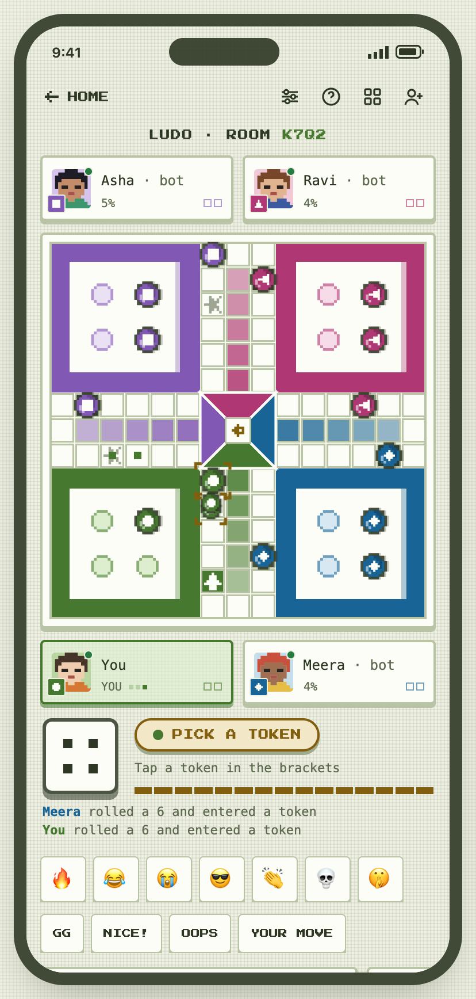
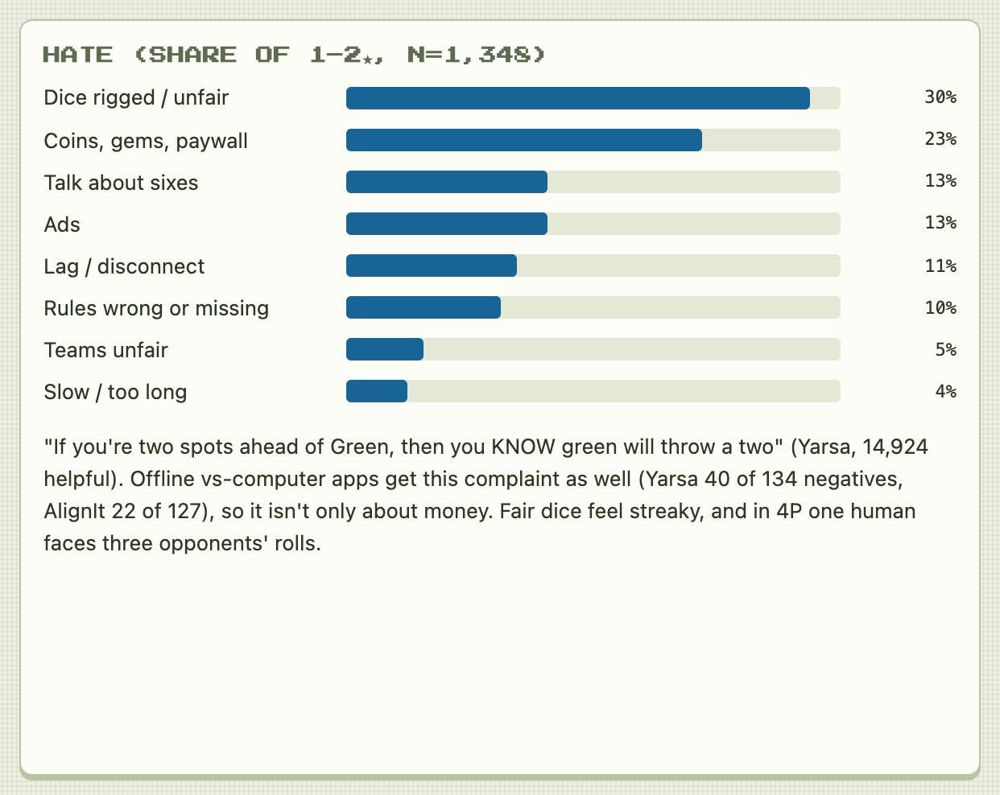
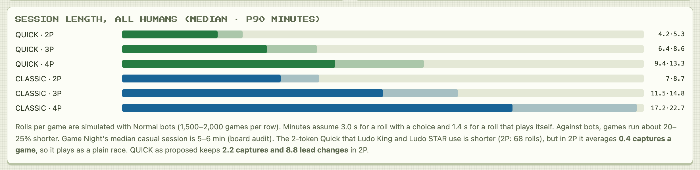
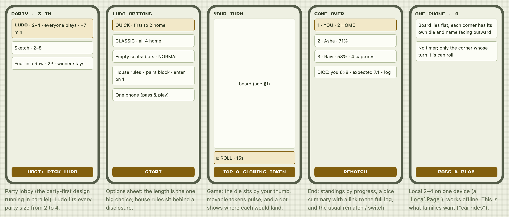
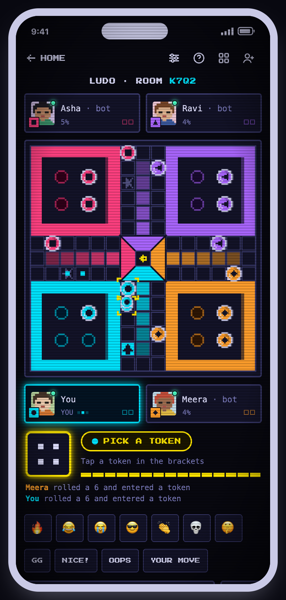
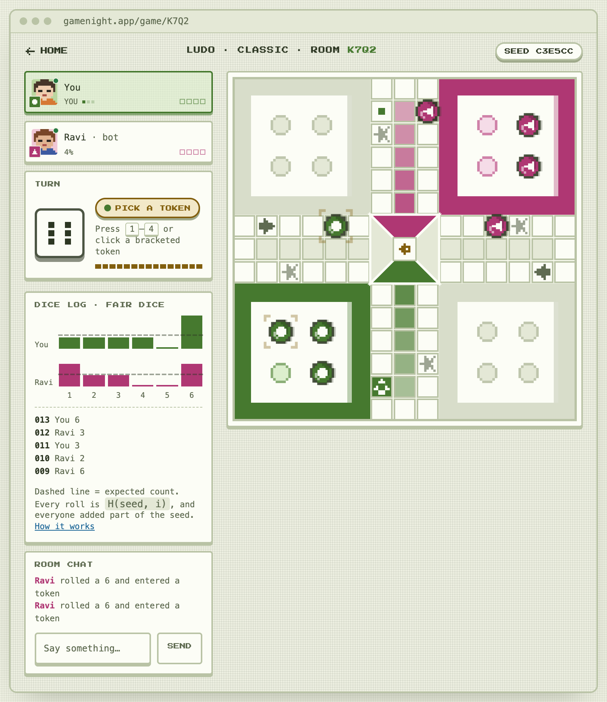
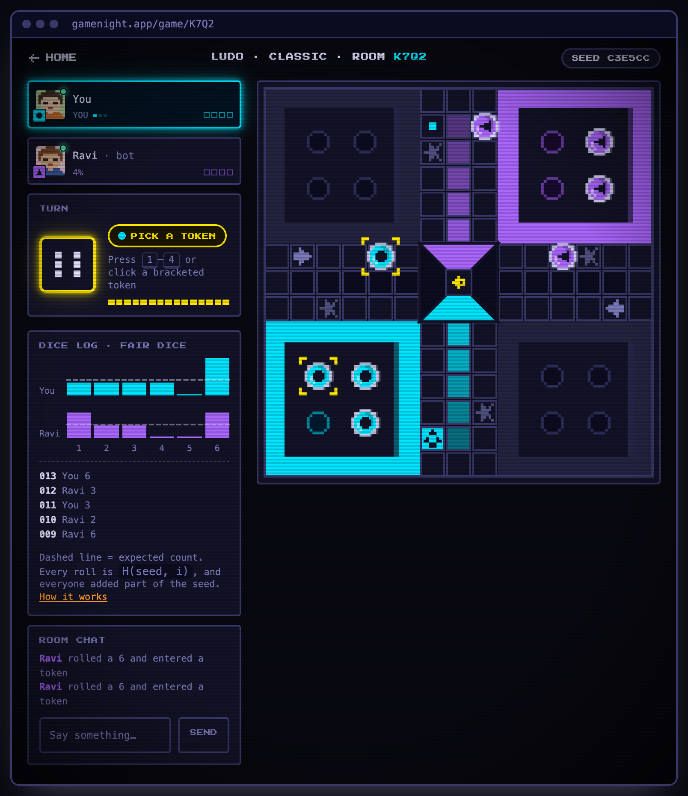
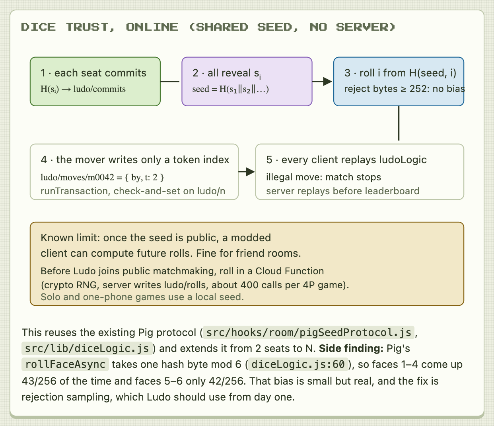
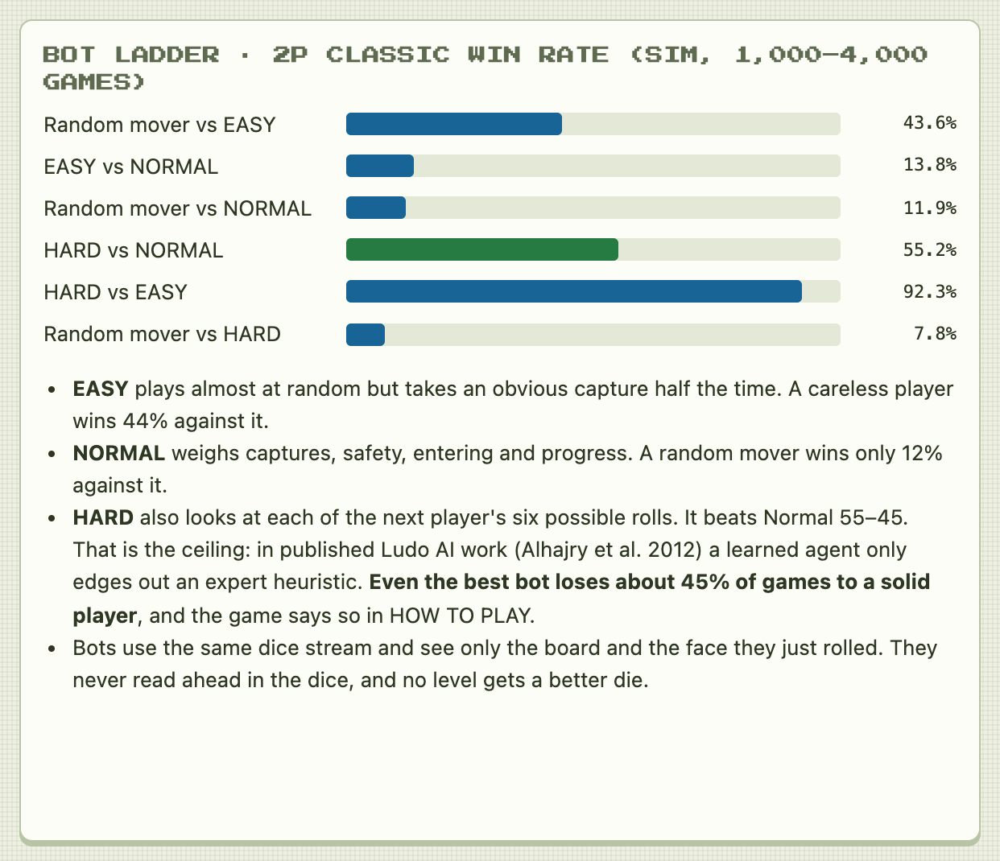

# PRD — Ludo (fair dice, 2–4 players)

> **Status: Parked** (captain, 2026-10-02: "add snakes, ludo into prd with detailed
> implementation with designs and screenshots. park these games"). The design is complete and
> ready to build; nothing is scheduled yet.

**One-liner:** classic Ludo for 2–4 players: race four tokens around the cross, capture
opponents, get home on an exact roll. It plays online in a party room, on one phone passed
around the table, or solo against Easy / Normal / Hard bots. Ludo is known for dice that
players believe are rigged; this version uses a seed every player helps create, lets every
client replay and check the game, and shows the dice log on screen.

| | |
|---|---|
| `type` | `ludo` |
| Label / badge | `LUDO` / `LD` |
| Category | `board` (dice race), turn-based |
| Players | 2–4 (`nPlayer: true, minPlayers: 2, maxPlayers: 4, localMaxPlayers: 4`), `solo: true` |
| Integration | **D**-style custom page on the uid-keyed room (lobby → host START, like Chain Reaction 4P and Minigolf) + a `LocalPage` for one phone and solo |
| Network | RTDB only, deterministic replay of a move list over a shared commit–reveal dice seed. No WebRTC |
| Effort | **L**: about 12–14 dev-days in 4 phases (P1 is shippable alone) |
| Priority | **Parked** |

This PRD comes from the `games-research-ludo-s1` research and design pass, which includes a
review of 2,858 Play Store reviews, about 60,000 simulated games and a playable prototype.
"Ludo" is a generic name (the game descends from public-domain Pachisi); Ludo King's name, board
art and mode names are not used. Everything below marked **default** is the design board's
recommendation, recorded because the captain parked the game before answering (see
[Decisions](#decisions)).



## Why Ludo

- **Demand.** Ludo King has 1B+ installs (3.97★, 10.3M ratings), and Ludo STAR, Ludo Club,
  Yarsa Ludo and Yalla Ludo each have 100M+. India is Game Night's largest casual audience.
  Ludo ranked #1 in both the 2026-10 board-game audit and the competitor review of the JindoBlu
  "2 Player Games" app.
- **The weak spot is trust.** In a sample of five top apps, **30% of 1–2★ reviews say the dice
  are rigged** (407 of 1,348). That is the biggest theme, ahead of coins/paywalls (23%) and ads
  (13%). Offline vs-computer apps with no money involved (Yarsa, AlignIt) get the same
  complaint, so it is partly how fair dice *feel*. With honest dice, in **35% of 2-player games
  one player rolls 5 or more extra sixes**. The apps that sell dice outcomes (re-rolls, "lucky
  dice", "watch an ad for a 6") have the worst reviews.
- **What players praise:** family and childhood (236 mentions), playing offline on one phone,
  difficulty levels, correct and configurable rules, progress %, and 2v2 teams.



| App (Play, India, 2026-10-02) | Installs | ★ | 1★ share | Notes |
|---|---|---|---|---|
| Ludo King | 1B+ | 3.97 | 18% | Classic / Quick / Master; vs computer, local, online, private; diamonds buy re-rolls |
| Ludo STAR | 100M+ | 4.43 | 9% | Classic / Master / Quick / Team Up; house rules |
| Ludo Club | 100M+ | 4.04 | 16% | Classic / Rush / Bolt; no ads, paid dice |
| Ludo (Yarsa) | 100M+ | 4.09 | 14% | Offline only; progress %; "watch an ad for a 6" |
| Ludo Offline (AlignIt) | 10M+ | 4.28 | 10% | Team Up praised; "engine is unbiased" praised |

## Game rules (defaults)

The common Indian app ruleset, which is what this audience expects:

- **Board:** a 52-square shared ring on a 15×15 cross; four yards; one private 5-square home
  column per colour, then the centre. Play goes clockwise. In 2P the players sit on **opposite
  corners**.
- **Leaving the yard:** a token leaves only on a **6**, onto its start square.
- **Extra rolls:** a 6, a capture and a token reaching home each give another roll. **Three 6s
  in a row** forfeit the turn (the third roll does not move).
- **Capture:** landing on a lone opponent token sends it back to its yard.
- **Safe squares (8):** the four start squares and the four stars, 8 steps after each start.
  Any number of colours can share them. Home columns are private.
- **Pairs are safe** (default, D2): two tokens of one colour on a square cannot be captured but
  **do not block** others from passing. In simulation this costs nothing in length (2P median
  170 vs 170 rolls), and it answers the most-upvoted rules complaint ("two of your pieces should
  block/protect", 5,408 helpful).
- **Exact roll** to land in the centre. A roll that would overshoot cannot be used by that
  token.
- **No legal move:** the roll is spent (a 6 still rolls again).

### Modes and length (D1)

| Mode | Rule | 2P | 3P | 4P |
|---|---|---|---|---|
| **QUICK** (default) | one token starts on its start square; first to bring **2** home wins | 101 rolls · ~4 min (p90 5) | 156 · ~6 min (p90 9) | 230 · ~9 min (p90 13) |
| **CLASSIC** | all 4 tokens home | 170 · ~7 min (p90 9) | 281 · ~11.5 min (p90 15) | 425 · ~17 min (p90 23) |

Rolls are simulated medians with Normal bots (1,500–2,000 games per row). Minutes assume 3.0 s
for a roll with a choice and 1.4 s for a roll that plays itself; 32–36% of rolls need no
decision. Against bots, games run about 20–25% shorter. In 3–4P the match ends at the **first
winner**, and everyone else is ranked by progress %.



**Rejected:**
- *Ludo King / STAR style Quick (2 tokens, both out):* in 2P it averages **0.4 captures a game**,
  so it plays as a pure race.
- *"Capture before entering home" (Master) as a default:* in 2P **41% of rolls are dead** and
  1.9% of games never finish. It is fine as a 3–4P house rule.

**House rules** (lobby disclosure, off by default):
- **Pairs block passage:** 4P +20% length, and no-move rolls rise from 13% to 17%.
- **Enter on 1 or 6:** 2P −6% length, and no-move rolls drop from 11% to 6%.
- **Capture before home:** 3–4P only.
- **Play for places:** 3P +15%, 4P +25%.
- **Teams 2v2:** v1.1 (D5). Partners sit opposite; the team wins when both partners finish.

## Screens

| Screen | Content |
|---|---|
| Party lobby | Card "LUDO · 2–4 · everyone plays · ~7 min". In the party-first flow, Ludo seats everyone at every party size from 2 to 4, never "winner stays" |
| Options sheet | QUICK / CLASSIC (the one big choice), empty seats → bots + level, house rules disclosure, one phone |
| Game | HOME bar, `LUDO · ROOM CODE` title, four `PlayerCard`s (two above the board and two below, each beside its own yard), board, dock with die + turn pill + 15-segment timer, event feed, emote row, quick chat, chat input |
| Game over | Standings by progress, captures, dice summary vs expected (link to the full log and seed), then the standard REMATCH / SWITCH |
| One phone 2–4 | The phone lies flat; each corner gets its own die and a name facing outward; only the corner whose turn it is can roll; no timer |
| Solo | Same as one phone with 1–3 bot seats, Easy / Normal / Hard, W/L tally per level |



### Final look

The game screen is built from Game Night's shipped room parts, not new chrome:
- the HOME bar with its icon buttons, and the room title with the code in `--c-p1`;
- `PlayerCard` (pixel avatar, seat chip, online dot, `YOU`, PixelDots while active);
- the `GameStatus`-style turn pill, `EmoteBar` tiles, quick-chat chips and the chat input.

The materials are each theme's own (`src/index.css`, per-theme effects block):
- **MATCHA:** 3 px LCD dot grid, cards on a 3 px base, the die on a 5 px ledge.
- **MIDNIGHT:** neon glows (`--glow`), CRT scanlines.

| | MATCHA (default) | MIDNIGHT |
|---|---|---|
| Phone, 4P party room |  |  |
| Desktop, 2P room with dice log |  |  |

**Board art:**
- A 15×15 crisp-edged SVG (`shape-rendering: crispEdges`), coloured only by `--c-p1…p4`; every
  theme already defines four seat colours.
- **Tokens** are pixel sprites: a stepped 8×8 disc with a dark outline, a highlight and shade
  pixel, and a **seat glyph** (circle / square / triangle / diamond). Colour is never the only
  cue, which is a review-a-game checklist item.
- Yards hold pixel nest rings. Safe squares carry a pixel star, start squares a pixel arrow in
  the direction of travel, and the centre a home icon.
- The board rotates so the viewer's yard is bottom-left. The `PlayerCard` rows mirror that
  layout.
- **Selection:** movable tokens get blinking corner brackets. Each shows a pixel landing dot,
  or a red pixel ✕ when the move captures.
- **Events:** a seat-coloured banner pops up for CAPTURE!, HOME!, NEED A 6, NO MOVE and THREE
  6s. It uses steps() motion, and reduced motion turns blinking and nudges off.
- **Avatars** follow the avatar exception in `theming-rules.md` (fixed palette, never `--c-*`).
  No hex anywhere.

### Controls

- **Phone:** the die sits in the dock under the right thumb. After a roll, only movable tokens
  accept taps; each has a hit area of at least 44 px, resolved to the nearest movable token
  (a cell is about 23 px at 360 px wide). A stack opens a small picker.
  - A roll with exactly one legal move plays itself after a 0.5 s beat (setting, on by default).
  - A roll with no legal move passes after 0.8 s.
  - Haptics fire on roll, capture and home (`haptics.js`).
- **Desktop / keyboard** via `useGameKeys`: Space rolls, 1–4 picks token 1–4, and Enter takes
  the highlighted move. Movable tokens are focusable buttons with `aria-label`s.
- **Speed:** about 70 ms per square of travel, about 0.4 s dice tumble, and no full-screen
  celebrations between turns. An animation-speed setting answers the "dizzying dice" complaint.

## Network model

### Room data

```
games/{gameId}
  gameType: 'ludo'
  status, players (uid-keyed), scores (uid-keyed), presence, hostUid, …   // existing room keys
  ludo:                                   // FIELD_NULLS · whole match in one node
    rules:   { mode: 'quick'|'classic', pairs: 'safe'|'off'|'block',
               entry: [6] | [1,6], captureBeforeHome: false, places: false }
    seats:   ['uidA', 'uidB', 'uidC']     // turn order = seat colour order (0..3)
    commits: { uidA: 'hex', … }           // H(sᵢ), written at START
    reveals: { uidA: 'hex', … }           // sᵢ, written once every seat has committed
    seed:    'hex'                        // H(s₁‖s₂‖…), written by the first client to see all reveals
    n:       42                           // move count (check-and-set for every append)
    moves:   { m0000: { by: 'uidA', t: 2 }, m0001: { by: 'uidB', t: -1 }, … }
                                          // t = token index, -1 = no legal move / forfeit
    auto:    { uidC: 3 }                  // consecutive timeouts, 3 = seat on AUTO
    deadline: 1790917500000               // server-clock ms for the current decision
```

Like Animal Stack's `stack` node, all Ludo state sits in **one** `ludo` key. That keeps
`FIELD_NULLS` to one entry and lets the rules validate the node as a unit.

### Fair dice



1. **Seed:** at START, each seat writes `commits/{uid} = H(sᵢ)`. Once all seats have committed,
   each writes `reveals/{uid} = sᵢ`, and any client writes `seed = H(s₁‖…‖sₙ)`. This generalises
   the Pig coin flip (`src/hooks/room/pigSeedProtocol.js`) from 2 seats to N, including its
   recovery path: a seat that loses its secret before revealing restarts the flip with roles
   rotated, and the restart is announced to everyone.
2. **Faces:** roll *i* = `faceAt(seed, i)`, a hash-chain byte stream with **rejection sampling**
   (discard bytes ≥ 252, then `1 + b % 6`), so all six faces are exactly uniform.
3. **Moves:** the mover appends `{ by, t }` in a `runTransaction` that re-checks `n`, the turn
   (derived by replay) and that `t` is legal. The room never stores dice faces; every client
   derives them.
4. **Replay:** every client runs `replayLudo(rules, seats, seed, moves)` on each snapshot. An
   illegal move in the list stops the match with "MOVE REJECTED" for everyone. A late joiner or
   spectator replays instantly; only the newest move animates.
5. **Proof for players:** the end screen shows the seed and per-player face counts against the
   expected count. "CHECK THIS GAME" replays it locally.
6. **Leaderboard:** `creditMatchResults` replays the move list before crediting a win, extending
   `verifyRound` in `functions/src/core.mjs`.

**Known limit (D3):** once the seed is public, a modified client can compute every future roll.
That is acceptable for friend and party rooms. **Before Ludo joins public matchmaking**
(`src/lib/matchmaking.js`), move rolls to a callable Cloud Function: crypto RNG, the server
appends `ludo/rolls/{i}`, rules deny client writes there, and the client keeps the rest of the
replay. That is about 400 invocations per 4P game. Solo and one-phone games use a local
`mulberry32` seed (`src/lib/detMath.js`), with no network.

**Side fix (ship with P1):** Pig's `rollFaceAsync` takes one hash byte mod 6
(`src/lib/diceLogic.js:60`). Because 256 = 42·6 + 4, faces 1–4 come up 43/256 of the time and
faces 5–6 42/256, so sixes are 2.3% rarer than they should be. Move both games onto the shared
rejection-sampled `faceAt` helper, applied from the next match so rooms mid-game keep their
sequence.

### Turn flow and dropouts

| When | Behaviour |
|---|---|
| Your decision | `deadline` = now + 15 s (× the room's `timerScale`) on the server clock (`useServerClock`), shown as the 15-segment bar |
| Timeout | Any seated online client appends the auto-move. It is the **Normal bot's** deterministic choice, so every client agrees. `auto[uid]++`; at 3 the seat shows AUTO and keeps auto-playing until its owner taps BACK |
| Disconnect | After `CR4_OFFLINE_GRACE_MS` (15 s), the same auto-move path runs, following the `chainReaction4Logic.skipAwayTurn` pattern. A seat that never left its yard by then is eliminated, so the room can't freeze |
| Finish | An idempotent transaction by the first client whose replay sees the win: `status: 'finished'`, `winner` (uid), `scores[uid] + 1` |
| Rematch | The starting seat **rotates**. In 4P classic the first seat wins 27.3% vs 23.6–25.4% for the others, so rotation evens it out over a night |
| Spectators | Same replay. `SeatOffer` offers an empty seat between matches |

## Bots

Bots see exactly what a human sees: the board and the face just rolled. **The bot function's
signature takes no seed or dice stream**, so look-ahead is structurally impossible. No level
gets better dice.

| Level | Policy | Measured (2P classic) |
|---|---|---|
| **EASY** | a random legal move, but takes an obvious capture half the time | a random mover wins **43.6%** vs Easy |
| **NORMAL** | scores each move: capture (+60), home (+45), enter (+35), into the home column (+30), safe square (+14), change in exact one-roll threat × stake, progress | a random mover wins **11.9%**; Easy wins 13.8% |
| **HARD** | one-move expectimax: apply each move, then average over all six faces of the next player's roll (that player answering greedily); positions scored by progress minus risk | **Hard beats Normal 55.2%** (1,500 games); beats Easy 92.3% |



- **The skill ceiling is low, and the game should say so.** Published Ludo AI work (Alhajry,
  Alvi & Ahmed, IEEE CIG 2012) finds learned agents only edge out an expert heuristic. HOW TO
  PLAY says: "Dice decide most games. HARD wins about 55% against a strong player."
- **4P Hard needs tuning** before launch. The prototype's evaluation was tuned for 2P and scores
  21.9% vs three Normal bots (baseline 25%). A sim test pins the ladder (see Testing).
- First-time solo defaults to **Easy**; the end screen offers "TRY NORMAL".

## Decisions

The captain parked the game before answering. The **default** column is the design board's
recommendation and is what this PRD specifies; revisit when the game is unparked.

| ID | Question | Options | Default |
|---|---|---|---|
| D1 | Default match length | QUICK (first to 2 home, one token out) with CLASSIC one tap away / CLASSIC default / QUICK only | **QUICK default** |
| D2 | Two tokens on one square | safe but not blocking (+ block toggle) / no pair rule / pairs block | **safe, not blocking** |
| D3 | Online dice trust | shared seed now, server dice before public matchmaking / server dice from day one / seed only | **seed now, server later** |
| D4 | Bots and fairness copy | Easy/Normal/Hard + dice log + honest copy / two levels / no dice log | **three levels + dice log** |
| D5 | v1 scope | online 2–4 + one phone 2–4 + bots, Teams in v1.1 / Teams in v1 / online first | **online + one phone + bots** |
| D6 | Build order | Ludo first among new games (shares a dice kit with Snakes & Ladders) / Chess first / after the physics games | **Ludo first** (now superseded: parked) |

## Files

**New:**
- `src/lib/ludoLogic.js` + `.test.js`. Pure and `// @ts-check`:
  - Geometry: `RING`, `ringOf`, `isSafeRing`, `seatsFor`.
  - Rules: `createState(seats, rules)`, `legalMoves`, `applyRoll` (capture, bonus rolls, three
    sixes, pairs, house rules), `finishAt` for QUICK.
  - Replay and scoring: `replayLudo(rules, seats, seed, moves)` → `{ state, faces, events,
    turn, winner, illegalAt }`, `standings`, `progress`.
- `src/lib/ludoBots.js` + `.test.js`: `pickBotMove(state, face, level, rng)`; `threatAt`,
  `scoreMove`, `evaluate`, expectimax. There is no dice input in any signature.
- `src/lib/fairDice.js` + `.test.js`: `faceAt(seedHex, i)` (rejection sampling),
  `deriveSeed(reveals)`, `commitSecret`. Pig moves onto `faceAt` as well.
- `src/hooks/room/ludoSeedProtocol.js` + `.test.js`: the N-seat commit → reveal → derive
  steps, recovery and reset announce (modelled on `pigSeedProtocol.js`).
- `src/components/LudoBoard.jsx`: the SVG board, token sprites, stacks, brackets, landing dots,
  step animation, rotation and the banner. Theme tokens only.
- `src/components/LudoDock.jsx`: the die button (`useBusy` while a move posts), turn pill,
  segmented timer and event feed.
- `src/components/LudoDiceLog.jsx`: per-player face bars against the expected count, the roll
  log and CHECK THIS GAME.
- `src/pages/LudoGame.jsx`: the room page on the uid-keyed nPlayer model. It handles
  `startRound`, the seed protocol, the append transaction, the timer and AUTO, away skip,
  finish, rematch rotation and spectators.
- `src/pages/LudoLocal.jsx`: one phone 2–4 + solo vs bots, offline (`LocalPage`).
- `tests/rules/ludo.test.js`: members-only writes to `ludo`, append-only `moves`, `n`
  monotonic, unchanged children accepted on whole-node transactions.
- `tests/e2e/ludo.spec.js`: 2P and 4P (one browser context per player): seed handshake, moves,
  timeout auto-move, a disconnect skip, finish, rematch.

**Touched:**
- `src/lib/games.js`:
  - the `GAME_TYPES` entry (`custom: true, nPlayer: true, minPlayers: 2, maxPlayers: 4,
    localMaxPlayers: 4, solo: true, category: 'board', durationMin: 7, tags: ['party', 'luck']`,
    lazy `Page` / `LocalPage`, and `startRound(players)` returning the seat order and rules);
  - `ludo: null` in `FIELD_NULLS`.
- `database.rules.json`: `ludo` in the `$other` key allowlist (line 73) and a `ludo` validate
  block. Every `.validate` must accept unchanged data (see `.claude/rules/firebase-rules.md`).
- `src/lib/rules.js`: HOW TO PLAY with the honest-dice line; `ruleMedia.json` clips.
- `src/components/GameIcons.jsx`: `LudoIcon` (pixel cross with four tokens).
- `src/lib/diceLogic.js`: Pig uses `fairDice.faceAt` for new matches.
- `functions/src/core.mjs`: a Ludo branch in `verifyRound` that replays the moves.
- `src/lib/sounds.js`: roll, step tick, capture, home, three-sixes stings (reuse where possible).

## Edge cases

- **Stacks:** two of your tokens on one square move separately, one at a time. Identical moves
  (two tokens in the yard, or a stacked pair) collapse to one choice, so a tap is never
  ambiguous.
- **A capture on a square holding a mixed set** of colours captures every lone opponent token
  there; a pair stays safe.
- **Three 6s on a roll that would have captured:** the turn is forfeited and nothing moves.
- **Winning roll on a bonus:** the game ends immediately; the bonus roll is not taken.
- **A player leaves mid-match** (not just offline): they are treated as away, so their seat
  auto-plays or is eliminated; they can rejoin the seat while the match runs.
- **Seed never completes** (a seat never reveals): after the grace period that seat is dropped
  from the seat list and the flip restarts without it; with fewer than 2 seats left, the match
  cancels back to the lobby.
- **Switching game mid-match:** `ludo: null` clears everything; no other keys are touched.
- **Clock skew:** deadlines only via `getServerNow()`.

## Testing

- **Logic (Vitest):** entry on 6, extra rolls, three sixes, exact home, capture and safe squares
  for every seat, pairs (safe / off / block), house rules, QUICK finish, replay determinism
  (same seed + moves ⇒ same state), and illegal-move detection. The prototype already passes
  10 such tests (`games-research-ludo-s1/prototype-code/ludoLogic.test.js`).
- **Fair dice:** `faceAt` uniformity (chi-square over 600,000 faces), no face outside 1–6, and
  determinism.
- **Bot ladder (sim test, seeded, about 2 s):**
  - Easy ≤ 50% vs a random mover.
  - Hard 52–60% vs Normal in 2P, and ≥ 25% vs three Normal bots in 4P.
  - 3P QUICK seat balance within ±4 pp.
- **Rules tests** (`npm run test:rules`) and **e2e** (`npm run test:e2e -- tests/e2e/ludo.spec.js`).
- **Manual:** one phone 2–4 on a real 360 px Android; MIDNIGHT and MATCHA; reduced motion;
  screen reader names on tokens and the die.

## Phases and effort (≈ 12–14 dev-days)

| Phase | Scope | Effort |
|---|---|---|
| **P1 · Core + solo + one phone** | `ludoLogic` + tests, `fairDice` (+ the Pig fix), `ludoBots` + ladder test, `LudoBoard`, `LudoDock`, `LudoLocal` (solo 1–3 bots, one phone 2–4), registry entry, HOW TO PLAY, icon, sounds. **Shippable alone**, offline | 5–6 d |
| **P2 · Online** | `ludoSeedProtocol`, `LudoGame` (START, append transaction, replay, timer + AUTO, away skip, finish, rematch rotation, spectators), dice log, rules + rules tests, e2e 2P/4P | 4–5 d |
| **P3 · Trust + polish** | `verifyRound` replay, CHECK THIS GAME, end-screen dice summary, juice and haptics pass, real-device QA | 1.5–2 d |
| **P4 · Later** | Teams 2v2 (1 d), server-rolled dice for public matchmaking (1.5 d), shared dice-race kit with Snakes & Ladders | — |

## Risks

| Risk | Impact | Mitigation |
|---|---|---|
| "Rigged" reviews anyway | high | dice log on screen, seed on the end screen + CHECK THIS GAME, honest HOW TO PLAY line, nothing for sale that touches dice |
| 4P sessions drag or stall | med | QUICK default, 15 s timer, auto-move for forced rolls (a third of all rolls), AUTO seats, away skip |
| Board legibility at 360 px | med | only movable tokens take taps, 44 px nearest-token hit area, stack picker, real-device test |
| Seed foresight by a modded client | low (friend rooms) | server dice before public matchmaking (D3) |
| 3P seat skew in QUICK | low | the prototype sim shows the second seat winning 37.2% vs 30.3–32.5% (1,500 games) while 3P CLASSIC is even. Rotate the starter, re-sim with the final bot, and fall back to CLASSIC for 3P if it persists |
| Unchanged-children re-validation in whole-node transactions | med | one `ludo` node, `.validate` compares with `data`, covered by a rules test |

## Where TypeSafe Jev fits

- **Not the dice or the bot moves.** Dice must come from an auditable seeded stream, and bot
  moves must be deterministic and testable. A model choosing moves would be the opaque "rigged"
  box players distrust, and Ludo's skill ceiling leaves it little to add.
- **Yes: "rigged" feedback triage** (first integration). A Cloud Function runs one request per
  in-app report or store review mentioning Ludo: a Noul for "claims dice/bot are unfair", a
  Choice for the mode, and a Score for severity. Fairness complaints get a templated reply
  linking that match's dice log. It reuses the competitor lane's `jev-themes.mjs` question set;
  the key stays server-side.
- **Maybe (v1.1): bot reaction lines** as a Choice over a fixed family-safe list keyed on the
  event. A lookup table does the same offline, so this is optional.

## Stretch

- Teams 2v2 with a partner-move hint.
- A Pachisi heritage board skin (cosmetic, fits the cosmetics-only plan).
- A weekly "Ludo night" leaderboard per friend group.
- Shake to roll on native.
- A shared **dice-race kit** with Snakes & Ladders (die component, `fairDice`, N-seat turn
  loop, away handling, dice log).

## Sources

- Research report and board: `kun-agent-workspace/data/games-research-ludo-s1/` (`report.md`,
  `board/index.html`, `evidence/`, `prototype-code/`).
- Google Play listings and 2,858 reviews (India storefront, 2026-10-02) for com.ludo.king,
  com.superking.ludo.star, com.moonfrog.ludo.club, io.yarsa.games.ludo, com.alignit.ludo.
- [Ludo (Wikipedia)](https://en.wikipedia.org/wiki/Ludo) ·
  [Ludo King (Wikipedia)](https://en.wikipedia.org/wiki/Ludo_King) ·
  [Gametion: Quick mode](https://blog.gametion.com/2021/01/ludo-king-rolls-out-quick-mode-and-6-player-online-multiplayer-updates/) ·
  [Ludo Club rules](https://www.ludoclub.net/ludo-rules/) ·
  [Alhajry, Alvi & Ahmed 2012](https://ieeexplore.ieee.org/document/6374142/).
