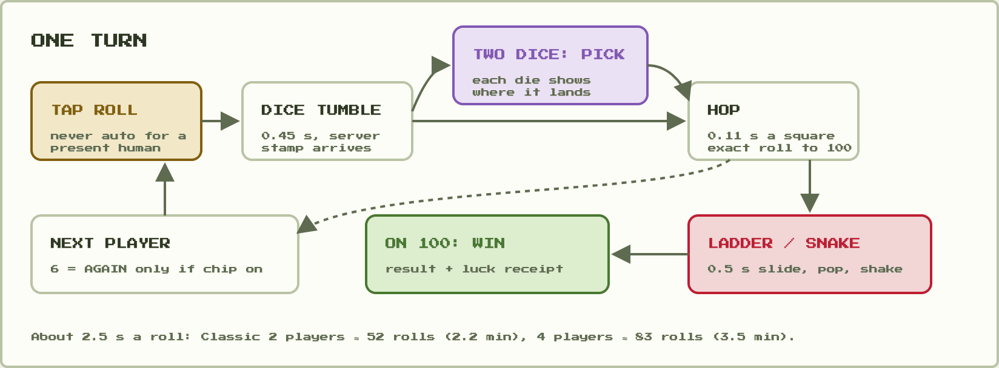
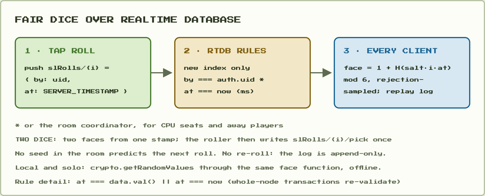
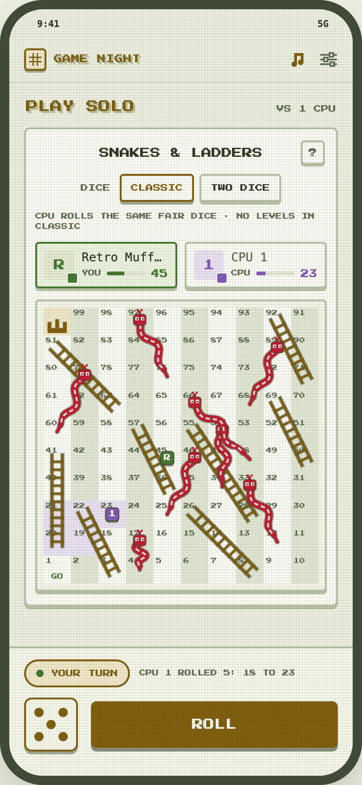
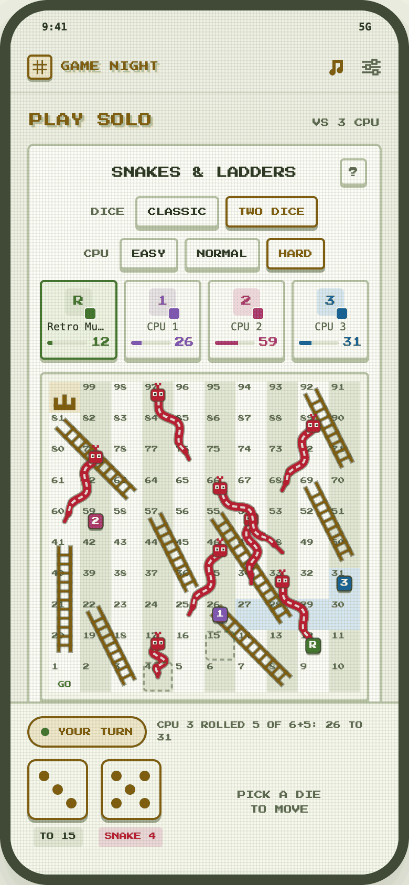
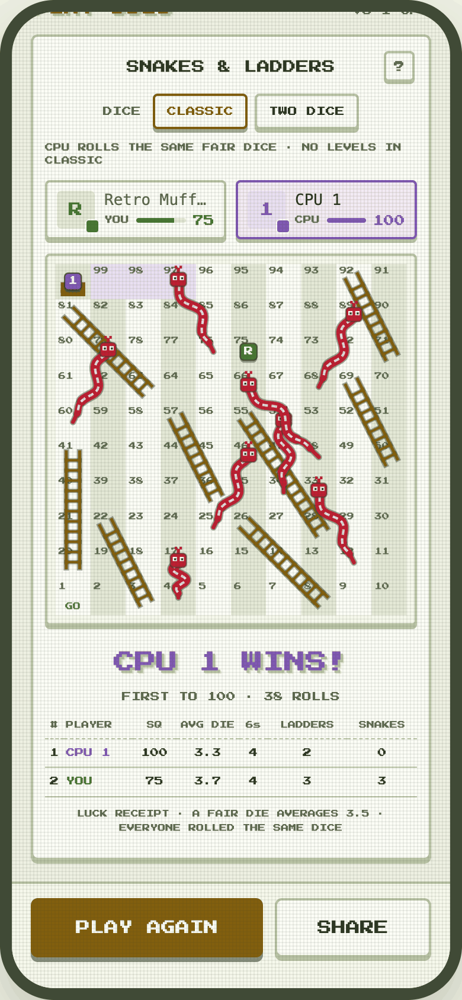
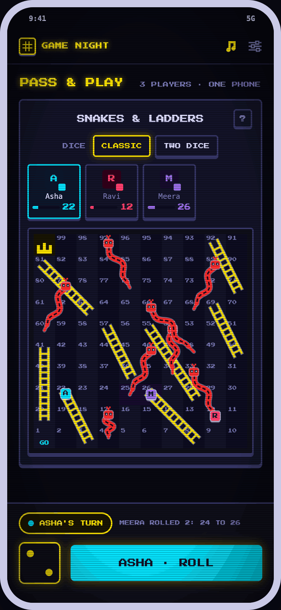
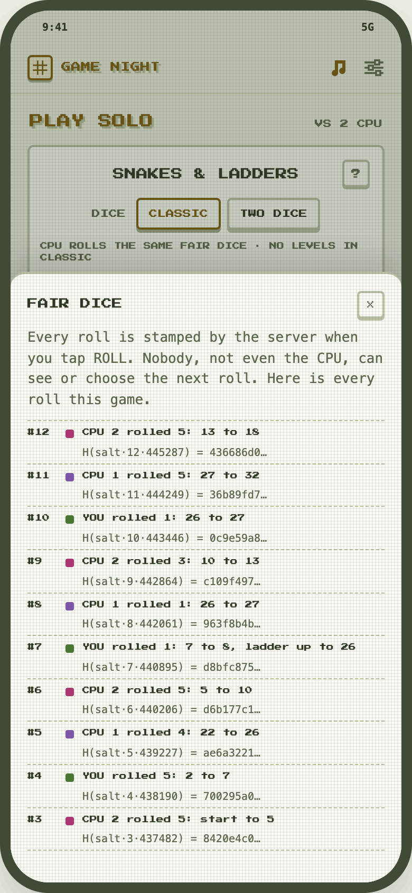
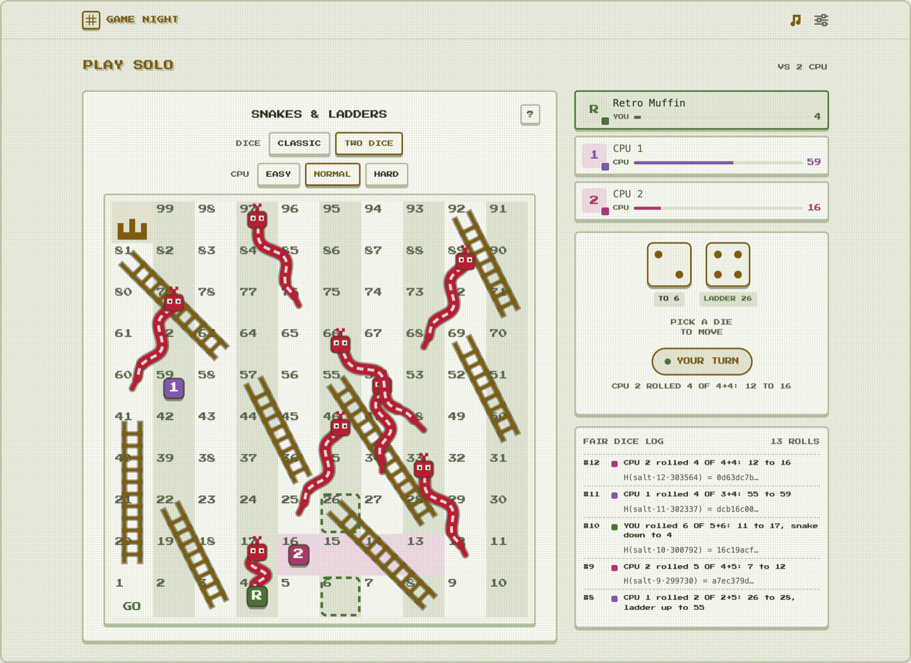
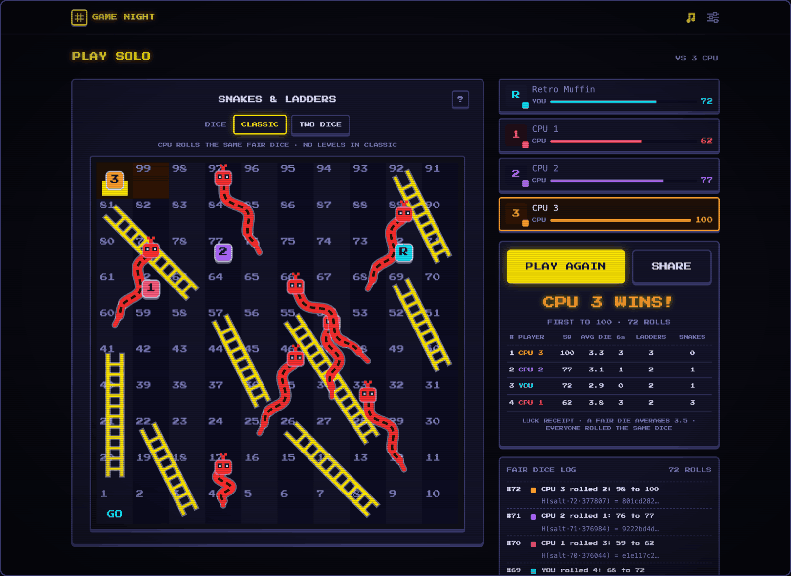

# PRD — Snakes & Ladders (race to 100, fair dice)

**Status: parked.** On 2026-10-02 the captain said: "add snakes, ludo into prd with detailed
implementation with designs and screenshots. park these games". This PRD is the parked spec. Nothing in it is
scheduled.

**One-liner:** the classic race to 100 for 2–4 players, on one 10×10 board of our own layout. It
plays online in the party flow, on one phone (pass-and-play), or solo against 1–3 CPU players.
Classic rules are the default. A TWO DICE variant (roll two, move by one) gives every turn a real
choice. Dice come from a server timestamp that nobody can predict or re-roll, because "the dice are
rigged" is the #1 complaint about every Snakes & Ladders app on the store.

| | |
|---|---|
| `type` | `snakes` (2–4, uid room) + `snakes-two` (`variantOf: 'snakes'`, TWO DICE) |
| Label / badge | `SNAKES & LADDERS` / `SL` · variant label `TWO DICE` |
| Category | `dicebluff` (with Pig and Docking) |
| Integration | **D-style custom page** on the uid-keyed room model (lobby → START), like Chain Reaction 4P, Minigolf and Archery 4P, plus a `LocalPage` for solo and pass-and-play |
| Network | RTDB only: an append-only roll log, replayed on every client (Minigolf's model) |
| Effort | **M**: about 3–5 dev-days in 3 phases (P1 is shippable alone). Less if Ludo lands first and shares the dice, tokens and fair-roll code. |
| Priority | **Parked** |

This PRD comes from the `games-research-snakes-s1` research pass:

- a review of 1,448 Play Store reviews of the top 4 Snakes & Ladders apps;
- exact Markov and Monte Carlo simulations of boards, rules and CPU policies;
- a playable prototype in the app's own material.

Every screenshot below is rendered from that prototype. The research scripts, the review sample and
the prototype live outside the repo, in
`kun-agent-workspace/data/games-research-snakes-s1/` (`report.md`, `research/`,
`board/index.html`). Decisions marked **default** are the board's recommendations, which the
captain has not answered yet.

## Why this game, and what to get right

- **Market.** Mobirix's Snakes & Ladders King has 50M+ installs but a 3.50★ rating, with 27% of its
  289,600 ratings at one star. Gametion (Ludo King's studio) is also at 3.54★. IDZ, which has
  themed worlds and Ludo bundled in, sits at 4.30★. The standalone apps rate badly. The game works
  as a quick social filler inside a bigger app, and that is the slot Game Night offers. In India it
  is a family classic ("Saap Seedhi").
- **What players hate**, from the 500 one-to-three-star reviews in the sample:

  | Complaint | Share | Note |
  |---|---|---|
  | Dice or CPU rigged | ~18% | after hand-checking the regex hits; even pass-and-play draws "player 1 always wins" |
  | Ads | 14% | |
  | Boring, auto-roll, no agency | 8% | |
  | Crashes | 8% | |
  | Same board | 8% | |
  | Coins and entry fees | 6% | |
  | Friend codes broken | 6% | |
- **What they love:** playing with family and kids, nostalgia, nice boards, and offline play. They
  ask for private rooms with friends, a 2× speed, choosing their own colour, remembered names, and
  playing on for 2nd and 3rd place.
- **So the design must:**
  - make the dice provably fair and visible;
  - give no CPU an edge it could only get by cheating;
  - never auto-roll a present human;
  - stay short;
  - offer one optional mode with a real decision.

## Game rules

- **Board:** 10×10, squares 1–100, boustrophedon numbering (square 1 bottom-left, rows alternate
  direction). Our own layout, with 8 ladders and 8 snakes:
  - ladders `3→22, 8→26, 20→41, 28→55, 36→57, 50→69, 63→81, 71→92`
  - snakes `17→4, 33→12, 46→25, 54→34, 66→48, 79→60, 89→68, 97→76`

  No jump lands on another jump's start, and nothing touches 1 or 100. The long late snake at 97
  makes the finish tense. A draft layout with a 99 snake dragged the game out (solo expected rolls
  rose from 34.6 to 59 under BOUNCE), so it was dropped.
- **Start:** every token starts off the board on square 0. The first move from 0 counts as normal
  (no "need a 6 to enter").
- **Move:** roll one die and walk that many squares. Landing at the foot of a ladder climbs it;
  landing on a snake's head slides to its tail. Tokens can share a square (no capture by default).
- **Finish:** **exact roll needed; if the roll overshoots 100, the token stays put** (D3, default).
  Chips: BOUNCE (walk back the extra) and OVERSHOOT WINS.
- **Sixes:** **a 6 does not give another roll** (default). Chip: 6 = AGAIN, where a third 6 in a row
  voids the turn. Simulation shows "6 = again" barely changes game length but adds streaks that read
  as rigging, so it is off by default.
- **Win:** the first token on 100 wins the room point (`scores[uid] + 1`, the standard machinery).
  The end screen ranks everyone else by square. Chip (later): PLAY FOR PLACES, which plays on until
  3rd place in 3–4 player games.
- **Turn order:** seats in join order. **The first player rotates every rematch**, and the first
  match picks a random first seat from the fair roll.
- **House-rule chip later:** BUMP (the Tamil Nadu rule): landing exactly on another token sends it
  back to its previous square. Not in v1.

### TWO DICE (variant `snakes-two`)

Roll two dice and move by **one** of them. Each die shows where it would land ("TO 47",
"LADDER 69", "SNAKE 25"), and both target squares blink on the board. A choice changes the outcome
in **32%** of positions (dodge a snake or catch a ladder). The game takes about half the rolls, and
CPU difficulty becomes honest. If both dice give the same result, the larger face is used. If both
overshoot under STAY, the token stays.

### Session length (20,000 simulated games per row; ≈2.5 s per roll)

| Setup | Avg rolls | P90 rolls | Minutes avg / P90 |
|---|---|---|---|
| Classic, 2 players | 52 | 77 | 2.2 / 3.2 |
| Classic, 3 players | 69 | 99 | 2.9 / 4.1 |
| Classic, 4 players | 83 | 116 | 3.5 / 4.8 |
| Classic 4P with BOUNCE | 90 | 132 | 3.8 / 5.5 |
| TWO DICE, 2P / 4P (≈4 s a roll) | 27 / 45 | 36 / 58 | 1.8 / 3.0 avg |

**Where the 2.5 s comes from:** the tap (~0.8 s), the dice tumble (0.45 s), 0.11 s per square
walked, and 0.5 s for a snake or ladder slide.

**Comebacks:** the leader after 10 rounds wins only 50–66% of games, so there is plenty of drama.

**Seat balance:** Classic is even, at 51.7 / 48.3 for 2 players. TWO DICE favours the first seat
(53.5 / 46.5 for 2 players), so the first player rotates every rematch.

## Modes

| Mode | Route | Players | Notes |
|---|---|---|---|
| Online | `/game/:id` (party room) | 2–4 humans, plus CPU seats via FILL WITH CPU | lobby → START; the coordinator writes CPU and away-player rolls |
| Pass-and-play | `/local/snakes` | 2–4 on one phone | names and colours remembered in `localStorage`; a "PASS TO …" banner; ROLL takes the player's colour |
| Solo | `/solo/snakes` | you vs 1–3 CPU | fully offline; same logic and component |

### CPU players

- **Classic:** CPU seats just roll the same dice. There is **no difficulty picker**, because a
  stronger CPU in a pure-luck game can only mean cheating. The UI says so: "CPU ROLLS THE SAME
  FAIR DICE · NO LEVELS IN CLASSIC".
- **TWO DICE:** the levels pick a die as follows.

  | Level | Policy | An attentive player wins |
  |---|---|---|
  | EASY | half of its picks are random, the rest NORMAL | 73% |
  | NORMAL | the die whose final square (after snakes and ladders) is furthest | 50% |
  | HARD | minimises the exact expected rolls to finish (policy iteration on the 101-state Markov chain, solved once per rule set, ~1 ms) | 48% |

  The figures come from 40,000 head-to-head games with seats alternated. A careless player (30%
  random picks) wins 34% against HARD. HARD's small edge is the honest ceiling, and its label says
  so: "plays perfectly · the dice still decide most games".
- CPU turns wait 0.7 s before rolling and 0.75 s before picking, so their turns can be followed.

## Fair dice

**Protocol (both modes):**

1. On ROLL the roller appends `slRolls/{i} = { by: uid, seat, at: ServerValue.TIMESTAMP }`, where
   `i` is the next index.
2. The rules enforce:
   - append-only (`!data.exists()` on a new index);
   - `by === auth.uid`, or the room coordinator for CPU and away seats;
   - `at === now`.
3. Every client computes the face:
   - `face = 1 + (u32 mod 6)`, where `u32` is read from `sha256(slSalt + ':' + i + ':' + at)` with
     **rejection sampling** (take the next 4 bytes while `u32 ≥ floor(2^32/6)*6`), so there is no
     modulo bias;
   - TWO DICE draws two faces from the same hash stream;
   - each client then replays positions from the whole log.
4. In TWO DICE the roller then writes `slRolls/{i}/pick` (0 or 1) exactly once.

**Why this works:**

- Nothing in the room predicts the next roll; it depends on the server's millisecond.
- A roll can't be retried, because the log is append-only.
- No commit-and-reveal setup is needed, which matters in a 2–4 player room where anyone can drop
  before revealing.

**Rule detail:** party pages run whole-node `runTransaction`s, and Firebase re-validates unchanged
children (`.claude/rules/firebase-rules.md`), so the rule is
`newData.val() === data.val() || newData.val() === now`. The `=== now` pattern already exists at
`database.rules.json:1048`.

**Residual risk:** a cheater would have to time a write to the exact server millisecond against
5–50 ms of network jitter. That is accepted for a free family game. A Cloud Function dice server
would close the gap at the cost of latency and Blaze calls. It is not recommended.

**Local and solo:** `crypto.getRandomValues` through the same face function, with no network.

**Do not reuse Pig's seed as-is.** Pig's commit-and-reveal (`src/lib/diceLogic.js:6-21`) can't be
biased, but once `diceSeed` is in the room any client can compute future faces with
`rollFaceAsync(seed, i)` (`diceLogic.js:57`, used at `Game.jsx:494`). Its `byte % 6` also favours
faces 1–4 (43/256 against 42/256).

**Shared with Ludo.** The Ludo PRD ([ludo.md](ludo.md)) already plans `src/lib/fairDice.js`: an
N-seat commit-and-reveal seed with a rejection-sampled `faceAt(seed, i)`. That PRD records the same
look-ahead limit as its D3 ("seed now, server later"). Snakes & Ladders adds the server-timestamp
entry point, `faceAtStamp(salt, i, at)`, to that module, and uses the same rejection sampling and
the same local path. The timestamp roll is also the "server later" fix for Ludo's D3 and for Pig and
Pig Big (a separate change; see Risks).

## UI (final-look screens, rendered from the prototype)

All screens use the app's own material:

- the GAME NIGHT nav bar and PLAY SOLO page head;
- MATCHA's LCD dot grid (MIDNIGHT gets scanlines);
- ledged cards and buttons (`src/index.css`, "Arcade material on light grounds");
- the segmented option rows of the solo pages;
- `PlayerCard`-style seat cards;
- the turn pill and Pig-style dice (`src/components/DiceBoard.jsx`);
- the sticky action bar that swaps to PLAY AGAIN / SHARE.

All colour comes from `--c-*` tokens, so every theme recolours the board with no extra art.

| Phone · Classic, your turn | Phone · TWO DICE, pick a die | Phone · end + luck receipt |
|---|---|---|
|  |  |  |

| Phone · pass-and-play, MIDNIGHT | Phone · fair-dice sheet ("?") |
|---|---|
|  |  |

### Screen spec

- **Phone (390 × 844):**
  - nav;
  - page head ("PLAY SOLO · VS 3 CPU" or "PASS & PLAY · 3 PLAYERS · ONE PHONE");
  - game card with:
    - the title and a "?" button;
    - the DICE row (CLASSIC | TWO DICE);
    - the CPU row (EASY | NORMAL | HARD) in TWO DICE solo only;
    - seat cards: 2 wide for 2 players, compact 4-up for 3–4;
    - the board panel (358 px, ~35 px squares).
  - **The sticky action bar holds the turn pill, the last-move line, the dice and ROLL**, all in the
    thumb zone. At the end it holds PLAY AGAIN (cta) and SHARE (outline), and the result and luck
    receipt render in the card, scrolled into view.
- **Desktop:** the board takes the left column (max 560 px), and a right rail holds the seat cards,
  a dice card (dice, ROLL, pill, last move) and the FAIR DICE LOG. Because this is a custom page,
  the two-column layout needs no `Game.jsx` branch.
- **Board art (SVG, tokens only, no hex):**
  - squares alternate `card` / `deep`, with numbers in `dim`;
  - square 100 is tinted `tint-cta` with a pixel crown; square 1 reads GO;
  - ladders are `cta` rails over a `text/.45` outline;
  - snakes are `danger` bodies that taper to the tail, with an outline, a `tint-danger` dash
    pattern, a square head with eyes and a forked tongue;
  - tokens are seat-colour (`p1`–`p4`) rounded squares showing the player's initial (CPU seats show
    1–3), with a small ledge, so colour is never the only cue. Up to 4 stack 2×2 on a shared square.
- **Motion:**
  - the dice tumble with `steps(6)` (0.45 s);
  - the token hops one square at a time (0.11 s);
  - the squares the last move crossed are tinted in the mover's colour;
  - the slide eases over 0.56 s;
  - "LADDER +19" or "SNAKE −21" pops at the landing square, and long snakes add a 0.36 s board
    shake;
  - the active token bobs.

  `prefers-reduced-motion` turns off the bob, shake, blink and tumble. 2× speed halves every timer.
- **Accessibility:**
  - each die in the pick state is a button with an `aria-label` ("Move 4, ladder 69");
  - the live announcer reads each move;
  - ROLL is keyboard-reachable through `useGameKeys` (Space / Enter);
  - in TWO DICE, keys 1 and 2 pick a die.
- **Fair-dice sheet:** a "?" opens a bottom sheet with one plain sentence ("Every roll is stamped
  by the server when you tap ROLL…") and the roll log `#i · seat · face · from → to · H(salt·i·at)`.
  On desktop the same log sits in the rail.
- **Luck receipt** (end screen): per player, the square reached, the average die (over every die
  rolled, both dice in TWO DICE), the sixes, the ladders and the snakes, with the line "A FAIR DIE
  AVERAGES 3.5 · EVERYONE ROLLED THE SAME DICE".

## Network model

- **Room:** uid-keyed party room.
  - `nPlayer: true, minPlayers: 2, maxPlayers: 4`.
  - `startRound(players)` deals seats in join order (`joinedAt`, then a uid tiebreak) and writes
    `slOrder: [uid…]`, a fresh `slSalt` (16 random bytes), `slOpts` (mode, finish, six, places) and
    the first seat, and clears `slRolls`.
  - CPU seats are synthetic uids from `PartyBotSetup`.
- **State is the log.** `slRolls` is a push-ordered object `{ i, by, seat, at, pick? }`. Every client
  runs `replaySnakes(slOrder, slOpts, rolls, faceFn)` to get positions, the turn, the winner and the
  stats. There is no turn pointer to keep in sync; a roll by the wrong seat is ignored by the replay
  (and rejected by the rules where it can be checked).
- **Writes:**
  - ROLL is one `push` with `ServerValue.TIMESTAMP`;
  - TWO DICE's pick is one write to `pick`;
  - the winner goes through the standard `runTransaction` (`winner`, `scores[uid] + 1`), written by
    whichever client first sees the winning replay, made idempotent with a `slScored` flag.
- **Away and AFK:** a seat whose presence is offline, or idle on its turn for 15 s, is auto-rolled by
  the online-aware coordinator (`src/lib/coordinator.js`, `isRoomCoordinator`) and tagged AUTO.
  Skipping them would punish them in a race; auto-rolling keeps the race fair and the game moving.
  In TWO DICE the auto-pick uses NORMAL.
- **Spectators** replay the log, animating only the newest roll.
- **Keys:** `slRolls`, `slOrder`, `slSalt`, `slOpts`, `slScored`. All are per match, so they go in
  `FIELD_NULLS`. PLAY AGAIN keeps `slOpts`, draws a new salt and rotates the first seat.

## Decisions

The captain parked the game on 2026-10-02 and has not answered D1–D5. The recommended option,
listed first, is recorded as the **default**.

| ID | Question | Options | Recorded answer |
|---|---|---|---|
| D1 | When to build | after Ludo, sharing dice, tokens and fair-roll code / before Ludo / do not build | **Parked** (captain). When un-parked: **after Ludo** (default) |
| D2 | Default mode | CLASSIC + TWO DICE variant / TWO DICE default / CLASSIC only | **CLASSIC + TWO DICE variant** (default) |
| D3 | Overshooting 100 | exact roll, stay put / bounce back / overshoot wins | **exact, stay put** (default) |
| D4 | Boards at launch | one 10×10 themed by the app theme / + 8×8 QUICK / picker of 3 art layouts | **one 10×10** (default) |
| D5 | Players | 2–4 (online, one phone, vs CPU) / 2–6 | **2–4** (default) |

## Files

**New:**
- `src/lib/snakesLogic.js` + `.test.js` (`// @ts-check`, pure):
  - `BOARD` (size, jumps) and `validateBoard`;
  - `step(pos, die, finish)`;
  - `replaySnakes(order, opts, rolls, faceFn)` → `{ pos, turn, winner, stats, trail }`;
  - `destinations(pos, faces, finish)` for the pick labels;
  - `cpuPick(level, pos, faces, finish, rng)`;
  - `expectedRolls(finish, pick)` (exact solve, memoised per rule set).
- `src/lib/fairDice.js` + `.test.js` (shared with Ludo; whichever game builds first creates it):
  - `faceAtStamp(salt, i, at)` (async SHA-256 via `src/lib/sha256.js`, rejection sampling, two
    faces per stamp for TWO DICE), added next to Ludo's `faceAt(seed, i)`;
  - `localFace()` (`crypto.getRandomValues`).
- `src/components/SnakesBoard.jsx`: the SVG board, tokens, trail, ghost targets, landing pops and
  shake. Theme tokens only.
- `src/components/SnakesDock.jsx`: dice, ROLL, the pick state, the turn pill and the last-move line.
  Reused by the action bar (phone) and the rail (desktop).
- `src/pages/SnakesGame.jsx`: the online party page (CR4 / Minigolf wiring: lobby, START, the
  coordinator, presence, AFK auto-roll, spectators, PLAY AGAIN / NEW MATCH / SWITCH).
- `src/pages/SnakesLocal.jsx`: solo vs 1–3 CPU and pass-and-play 2–4, offline.
- `tests/rules/snakes.test.js` and `tests/e2e/snakes.spec.js`.

**Touched:**
- `src/lib/games.js`:
  - the two entries (`snakes`, and `snakes-two` with `variantOf`), with lazy `Page` and `LocalPage`,
    `solo: true`, `durationMin: 4` and `tags: ['party', 'family']`;
  - `startRound`;
  - a `freshGameState` branch;
  - five keys added to `FIELD_NULLS`.
- `src/components/GameIcons.jsx`: `SnakesIcon` (a pixel ladder crossed by a snake, 24 px,
  `currentColor`).
- `src/lib/rules.js`: HOW TO PLAY for both types (a test requires one per type).
- `src/lib/sounds.js`: `ladderUp` (rising arpeggio), `snakeDown` (falling slide), and `hop` (a soft
  tick). The dice SFX is reused.
- `database.rules.json`:
  - add the keys to the `$other` whitelist (`database.rules.json:73`);
  - `slRolls/$k` validation:
    - `by` is `auth.uid`, or the coordinator for synthetic CPU uids;
    - `seat` is in `slOrder`;
    - `at === now` with the unchanged-data exception;
    - write-once, except `pick` (write-once, 0 or 1, by the same `by`).

  Note: the README's "no rules changes for new game keys" line predates the `$other` whitelist.
- `src/pages/Demo.jsx`: the solo card and the local dispatcher.

**Bundle:** under 1 KB gzip on the entry (two registry objects and the icon). Lazy chunks: the page
is about 8–10 KB, the local page about 4 KB, and the logic plus fair roll about 3 KB. There are no
new dependencies and no image assets.

## Edge cases

- **Double-tap ROLL:** `useBusy` sets the flag synchronously; the rules reject a second write to
  the same index; the replay ignores a roll by a seat that is not on turn.
- **Pick never written** (TWO DICE player drops after rolling): after 15 s the coordinator writes the
  NORMAL pick.
- **Both dice give the same result:** auto-pick the larger face and show "SAME SQUARE".
- **Overshoot under STAY:** the token doesn't move; the log says "needs exactly 3, stays on 97".
- **Two tokens on 100 in one replay:** impossible, because the replay stops at the first finisher.
- **Seat leaves mid-match:** the seat stays in `slOrder` and auto-rolls, so the race is never
  re-dealt. Leaving the room forfeits on rematch.
- **Game switch:** the `FIELD_NULLS` keys clear. PLAY AGAIN keeps `slOpts`.
- **Sparse reads:** `slRolls` is a push-key object; sort by key, and treat a missing node as an
  empty log (`normalize.js`).
- **Clock skew:** irrelevant; `at` is the server's value, not the client's.

## Testing

- **Vitest (`snakesLogic.test.js`):**
  - every jump is in range, no chains, nothing on 1 or 100;
  - `step` under STAY, BOUNCE and OVER at 95–100;
  - golden replays (a fixed log gives exact positions, winner and stats);
  - turn order and rotation;
  - 6 = AGAIN with the third-six rule;
  - TWO DICE ties;
  - `expectedRolls` matches the research values (Classic STAY solo 34.6);
  - HARD ≥ NORMAL ≥ EASY in a seeded 2,000-game duel.
- **Vitest (`fairDice.test.js`, the `faceAtStamp` cases):**
  - determinism for `(salt, i, at)`;
  - chi-square uniformity over 60,000 draws;
  - rejection sampling covers the boundary;
  - two faces from one stamp are independent.
- **Rules (`tests/rules/snakes.test.js`):**
  - a client `at` that isn't `now` is rejected;
  - an overwrite is rejected;
  - a foreign `by` is rejected;
  - the coordinator may write CPU rolls;
  - `pick` is write-once;
  - a whole-node transaction with unchanged rolls still commits.
- **E2E (`tests/e2e/snakes.spec.js`):** 3 contexts. Join, START, roll to the end with the replay
  agreeing on every client, a disconnect auto-roll with the AUTO tag, then PLAY AGAIN rotating the
  first seat.
- **Manual:** real phones for thumb reach and 2× speed; MATCHA, MIDNIGHT and two more themes for
  contrast on snakes and ladders.

## Phases and effort (≈ 3–5 dev-days)

| Phase | Scope | Effort |
|---|---|---|
| **P1 · Solo + local** | `snakesLogic` + tests, `fairDice` (local path) + tests, `SnakesBoard`, `SnakesDock`, `SnakesLocal` (vs CPU, pass-and-play), registry with `solo: true`, icon, rules text, sounds. **Shippable alone.** | 1.5–2 d |
| **P2 · Online** | `SnakesGame` party page, timestamp roll + rules + rules tests, coordinator auto-roll, spectators, fair-dice sheet and log, e2e | 1.5–2 d |
| **P3 · TWO DICE + polish** | the `snakes-two` variant, CPU levels, pick UI, landing pops and shake, reduced-motion QA, 2× speed, luck receipt | 0.5–1 d |

If Ludo ships first, `fairDice.js`, the dice component and the token art already exist; take about
1 d off P1 and P2.

## Risks

| Risk | Impact | Mitigation |
|---|---|---|
| Players still say the dice are rigged | high | same dice for the CPU, no Classic levels, the fair-dice log and sheet, the luck receipt, rotating first player |
| Boredom (pure luck) | med | TWO DICE, 2× speed, no slow animations, never auto-rolling a present human, the party wrapper (chat, emotes) |
| Timestamp timing attack | low | needs millisecond write timing against network jitter; accepted |
| Unchanged-children re-validation in whole-node transactions | med | every `.validate` compares with `data`; covered by a rules test |
| TWO DICE first-seat edge (53.5%) | low | random first seat and rotation every rematch |
| Overlap with Ludo | med | build `fairDice.js`, the dice and the tokens once; sequence the two builds |
| Predictable seeds: Pig and Pig Big today, and Ludo's planned seed (its D3) | med | separate fix: move them onto `faceAtStamp` |

## TypeSafe Jev

Jev has no place inside the game, because nothing in it calls for judgment:

- **Dice** must be an auditable function of the server timestamp.
- **CPU moves** are exact Markov maths, reproducible and offline.
- **Board balance** is computed exactly.

Jev fits around the game, in sorting store reviews and in-app reports after launch:

- a Noul each for "says the dice or CPU are rigged", "wants private rooms", "too slow" and "crash";
- a Choice for which mode.

That replaces keyword coding. It runs server-side, so no key ever reaches the client.

## Stretch

- BUMP and PLAY FOR PLACES house-rule chips.
- An 8×8 QUICK board (2 players, about 37 rolls, about 1.5 min).
- Seasonal board skins, still drawn from theme tokens.
- A best-of-3 frame for 2-player sessions.
- Up to 6 players (two more seat colours) if pass-and-play demand shows up.
