# Scene themes: five shelved designs in Shoreline's spirit

**Status: shelved, not built (2026-10-07).** These five themes were designed and prototyped, then parked. Nothing here is in the app. This document is the hand-off for whoever builds one later: it should be enough on its own, together with the prototype in [`designs/`](designs/).

| # | Theme | When | Font · bundle cost | Scene | Sound | Effort |
|---|---|---|---|---|---|---|
| 1 | [Haunted Hollow](#1-haunted-hollow) (upgrades PUMPKIN NIGHT) | Seasonal, Oct 1 – Nov 2 | Griffy · 68 KB (≈30 KB subset) | Moon, hill with tree and chapel, flickering jack-o'-lanterns, bats, ground fog | Wind, tawny owl, bottle whistle | 1.5–2 d |
| 2 | [Winter Lights](#2-winter-lights) | Seasonal, Dec 1 – Jan 6 | Mountains of Christmas Bold · 54 KB | Twinkling bulb garland, snowdrift with pines and a lit cabin, snowfall | Wind, fireplace crackle, passing sleigh bells | 2–2.5 d |
| 3 | [Stars & Stripes](#3-stars--stripes) | Seasonal, Jun 28 – Jul 6 (reuse Dec 31 – Jan 1) | Bungee · 0 KB (already bundled) | Fireworks over a city skyline on a shared clock | Launch whistle, boom, crackle, synced to bursts | 2 d (+0.5 d New Year palette) |
| 4 | [Festival of Lights](#4-festival-of-lights-diwali) (Diwali) | Seasonal, ~10 days around Diwali | Yatra One · 11 KB | Marigold toran, flickering diyas, rising sky lanterns, turning rangoli | Tanpura drone, temple bell, distant crackers | 2–2.5 d |
| 5 | [Monsoon Canopy](#5-monsoon-canopy) | Evergreen (promote Jun – Sep) | Baloo 2 · 32 KB | Swaying leaf canopy, rain, leaf-tip drips, puddle ripples | Rain, drips, tree frogs, bird, far thunder | 2 d |

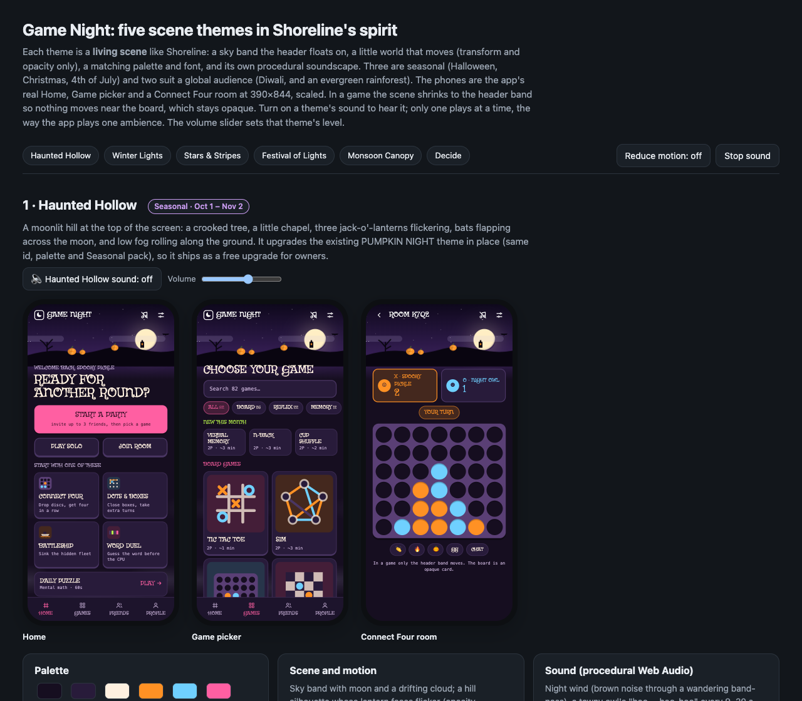

## The prototype

- [`designs/scene-themes-board.html`](designs/scene-themes-board.html) is the live design board, a single 325 KB file with the fonts inlined. Open it straight from disk in a browser. It shows 15 phone frames (each theme × Home, Game picker, Connect Four room, at 390×844 scaled), every scene animated. Each theme has a sound toggle and volume slider (one ambience plays at a time, as in the app), plus a global Reduce-motion toggle (the OS setting is honoured too) and Stop sound. The decision form at the bottom only sends answers when the page runs inside the Lavish review tool; on its own it just echoes the selection.
- [`designs/template.html`](designs/template.html) is the editable source. All scene markup is in `SCENES`, the per-theme copy and swatches in `SPECS`, the fireworks timing in `FIREWORKS_SHOW`, and every procedural sound in `AMBIENCES` (one factory per theme, `(ctx, out) → stop()`, the same shape as `src/lib/musicAmbience.js`). Per-theme tokens are the `.screen[data-t="…"]` blocks near the top of the `<style>`; reduced motion is the `body.rm` rules and the `prefers-reduced-motion` block.
- [`designs/build.py`](designs/build.py) rebuilds the board from the template by inlining the fonts. Bungee comes from `public/fonts/`; the other four are not committed, so download the latin `.woff2` files listed in [`designs/font-sources.css`](designs/font-sources.css) into `designs/fonts/` first (names are in the script). Verified: with the original font files it reproduces the committed board byte for byte.
- The prototype is a design reference, not app code. It uses inline `rgb()` swatches and a few hex values that the app's theming rules forbid in `src/`; port the tokens into `src/index.css` as `--c-*` triplets.

## Shared contract (how every theme fits the app)

All five follow the system SHORELINE established. References are to `main` at the time of writing.

- **Theme entry.** `src/lib/theme.js:24`: `{ id: 'shoreline', label: 'SHORELINE', font: 'fredoka', backdrop: 'beach' }`. `pairedFont()` and `themeBackdrop()` read `font` and `backdrop`. `pumpkin` (line 36) is a palette-only seasonal theme in the `themes-seasonal` pack.
- **Backdrop.** `src/components/ThemeBackdrop.jsx:14` returns null unless the backdrop is `'beach'`, and lazy-loads `BeachBackdrop` through `lazyWithRetry`. `active` is false on game screens. `BeachBackdrop.jsx` draws SVG strips sized to whole tile widths; all colour comes from `rgb(var(--c-…))` style props because SVG attributes cannot read `var()`. Pure timing lives in `src/lib/beachLogic.js`, and the CSS wash and the audio swell share one `performance.now()` clock.
- **Sound.** `src/lib/musicAmbience.js:138`: `AMBIENCES = { shore: createShore }`. Each factory plays on the music bus, so the music switch, volume, ducking and hidden-tab rules apply for free. `src/lib/musicLogic.js:77` maps `THEME_LOBBY_TRACK.shoreline = 'shore'` and line 80 lists `AMBIENT_TRACKS = ['shore']`. Shoreline's overall level is `LEVEL = 0.55` (`musicAmbience.js:12`); calibrate new ambiences against it by ear.
- **Tokens.** The standard `--c-*` set, plus scene-only tokens read only by the backdrop (Shoreline has `--c-sea`, `--c-shallow`, `--c-foam`, `--c-wet`, `--c-damp`). New scene tokens per theme: `sky`, `moon`, `fog`; `snow`, `flake`, `pine`, `bulb1-4`; `city`, `lit`, `fw1-4`; `clay`, `flame`, `marigold`, `lantern`; `canopy`, `leaf`, `rain`.
- **Motion.** Transform and opacity only, each moving thing on its own layer. Tiled layers move by exactly one tile (snow and rain fall by their tile height; fog and cloud drift a fixed distance), so loops are seamless and nothing repaints.
- **Reduced motion.** Each scene freezes on a pleasant frame, under both `[data-motion='reduced']` and the OS media query, as Shoreline does.
- **In a game.** Only the header band moves. Ground layers (fog, lanterns, rangoli, ripples, far rain and snow) are dropped, and near rain and snow are clipped to the band. Boards stay opaque cards. Follow whatever rule Shoreline settles on for waves in games.
- **Audio sources.** Oscillators, filtered noise buffers and envelopes only. No audio files, nothing to license.

### Groundwork before the first theme (about half a day)

1. `ThemeBackdrop.jsx`: replace the `=== 'beach'` check with a `SCENES` map (`{ beach: lazyWithRetry(() => import('./BeachBackdrop')), haunted: …, … }`), so each scene stays its own chunk.
2. `theme.js`: add an optional `season: { from: 'MM-DD', to: 'MM-DD' }` per entry (Diwali needs a per-year date table) and a pure, tested `inSeason(theme, date)`. Settings can then offer the seasonal theme during its window. Suggested product rule: offer it, never switch a player's theme for them.
3. `musicLogic.js`: add `THEME_LOBBY_TRACK` entries and append to `AMBIENT_TRACKS`. In `musicAmbience.js`, add one factory per theme, with pure timing in a `*Logic.js` beside it (like `beachLogic.js`, per `.claude/rules/game-logic-rules.md`).
4. Per theme: a token block in `src/index.css` (checked by `themeContrast.test.js`), an `@font-face` with `size-adjust` per `font.test.js`, the font in `FONTS` and `LICENSES.md`, the reduced-motion freeze, and `theme.test.js` / `ThemeBackdrop.test.jsx` cases.

## Recommendation (from the design review)

Build Haunted Hollow first when its window is near: it upgrades the existing `pumpkin` theme in place, so owners of the Seasonal pack get it at no cost. Winter Lights next, landing by Dec 1. If India is a large share of players, build Festival of Lights ahead of Diwali; the store already prices in INR (`premiumCatalog.js` has `paise` prices). Stars & Stripes can wait for June, and the same build covers New Year's Eve. Monsoon Canopy is the evergreen pick and can go in any time.

Colours below are `R G B` triplets in the app's `--c-*` format.

---

## 1. Haunted Hollow

**Seasonal, Oct 1 – Nov 2. Upgrades PUMPKIN NIGHT in place** (same id, palette and Seasonal pack), so it ships as a free upgrade for owners.

| Desktop board | Phone width |
|---|---|
| 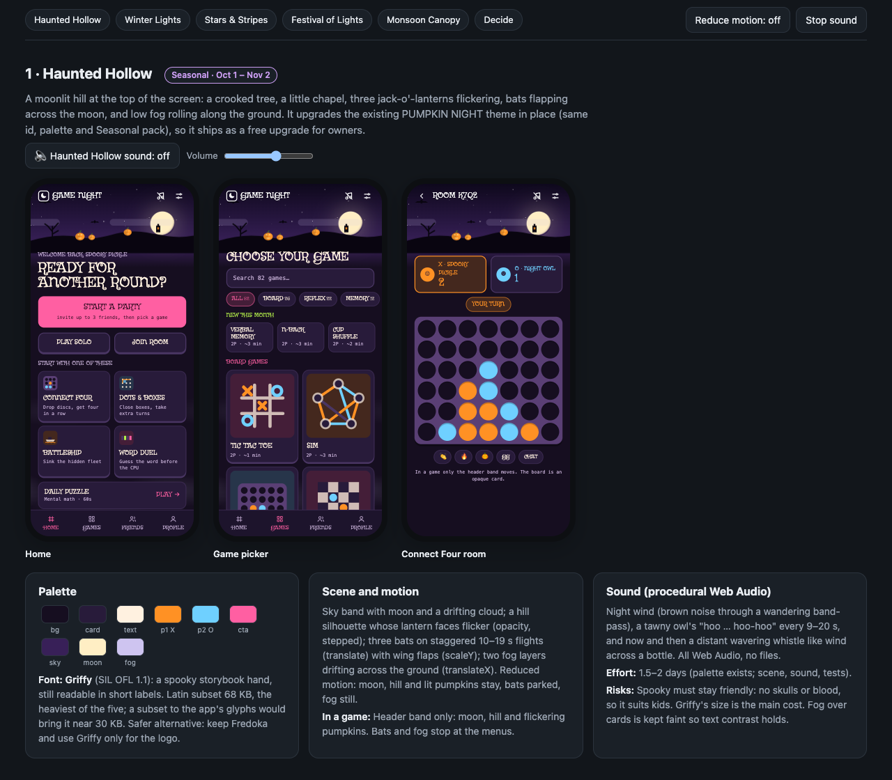 | 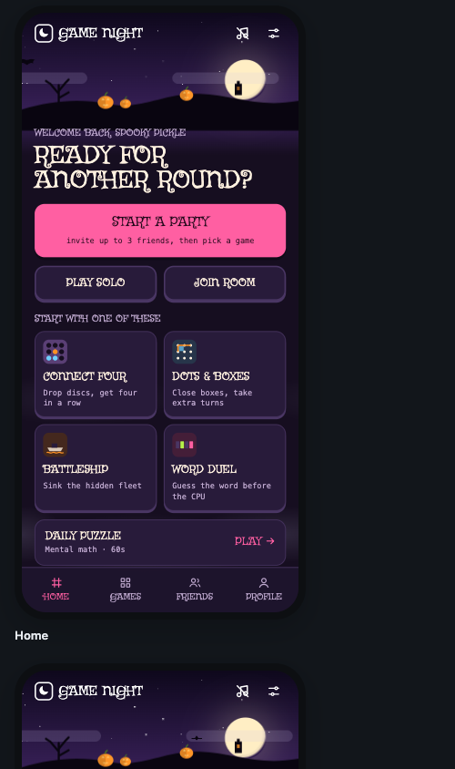 |

- **Palette.** Keeps PUMPKIN NIGHT's tokens: bg `22 14 32`, card `40 27 58`, text `255 241 224`, pumpkin X `255 145 36`, ghost-blue O `111 208 255`, candy CTA `255 95 162`. Scene: sky `14 8 28` to `56 32 88`, moon `255 238 196`, hill `9 5 16`, glow `255 150 40`, fog `206 196 240`.
- **Font.** Griffy (SIL OFL 1.1), a spooky storybook hand that stays readable in short labels. Latin subset 68 KB, the heaviest of the five; subsetting to the app's glyphs (A–Z, digits, punctuation) should bring it near 30 KB. Fallback: keep Fredoka and use Griffy only for the logo.
- **Scene.** Moon with a halo and a drifting cloud. A hill silhouette with a dead tree, a chapel with a flickering window, and three jack-o'-lanterns whose faces flicker (stepped opacity). Three bats on staggered 10/14/19 s flights (translate) with wing flaps (scaleY). Two ground-fog layers drifting at 46 and 70 s (translateX).
- **Reduced motion.** Moon, hill and lit pumpkins stay; bats parked; fog still.
- **In a game.** Header band only: moon, hill and flickering pumpkins. Bats and fog stay on the menus.
- **Sound.** Brown-noise night wind through a band-pass wandering 260–960 Hz. A tawny owl ("hoo … hoo-hoo-hoo", sine with 7 Hz vibrato) every 9–20 s. A wavering bottle whistle every 18–34 s. Source: `AMBIENCES.haunted` in the template.
- **Effort.** 1.5–2 days (the palette exists; scene, sound, tests).
- **Risks.** Spooky must stay friendly: no skulls or blood. Font size is the main cost. Fog over cards is kept faint so text contrast holds.

## 2. Winter Lights

**Seasonal, Dec 1 – Jan 6.** A light theme, so it is the holiday pick for players who dislike dark screens.

| Desktop board | Phone width |
|---|---|
| 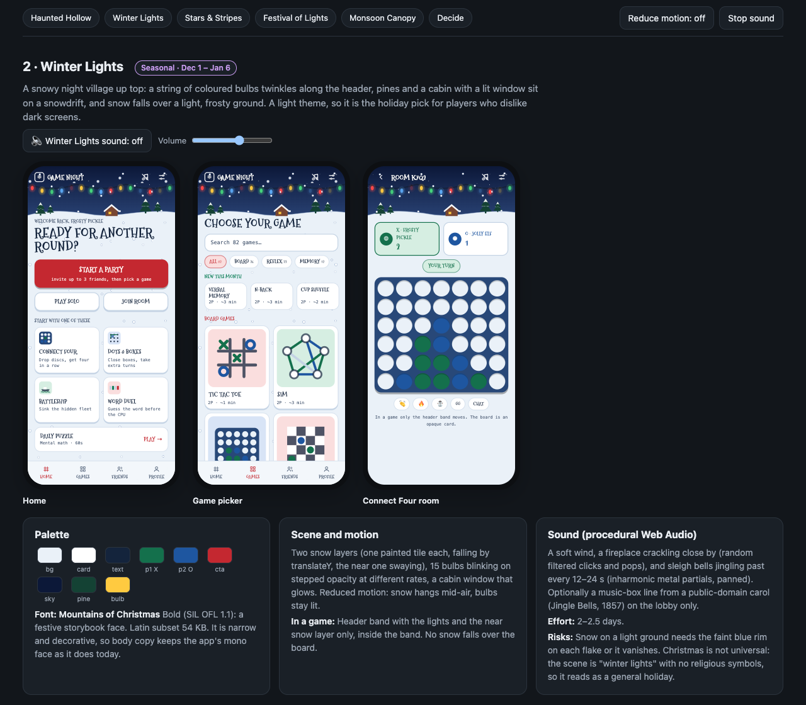 | 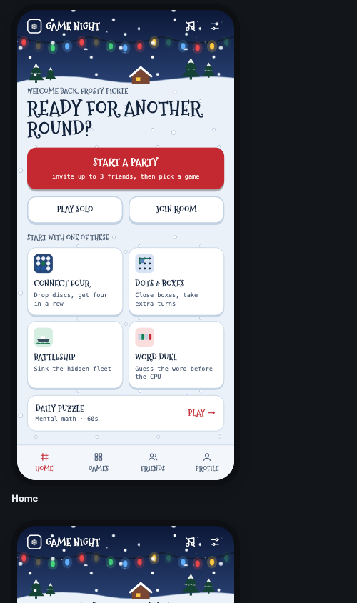 |

- **Palette.** bg `234 241 248`, card `255 255 255`, text `20 36 60`, pine-green X `20 112 76`, navy O `30 86 160`, holly-red CTA `196 40 48` with white ink, board structure `40 72 120`. Scene: night sky `12 24 56` to `44 70 122`, snow white with a `140 164 200` rim, pine `20 66 52`, bulbs red, gold (`255 202 64`), green and blue.
- **Font.** Mountains of Christmas Bold (SIL OFL 1.1), 54 KB latin. Narrow and decorative, so body copy keeps the app's mono face.
- **Scene.** A night-sky band with a 15-bulb garland along the header's bottom edge (stepped opacity, staggered rates); a snowdrift with pines and a cabin whose window glows. Two snow layers, each one painted tile falling by translateY: a near layer (6.5 s, swaying) and a far layer (14 s).
- **Reduced motion.** Snow hangs mid-air, bulbs stay lit.
- **In a game.** Header band with the lights and the near snow layer clipped inside the band. No snow over the board.
- **Sound.** Pink-noise wind. A fireplace crackle close by (random high-passed clicks plus the odd pop, panned left). Sleigh bells passing left to right every 12–24 s (four inharmonic partials per hit, 12–17 hits). Optional later: a music-box line from a public-domain carol (Jingle Bells, 1857), lobby only. Source: `AMBIENCES.winter`.
- **Effort.** 2–2.5 days.
- **Risks.** White flakes vanish on a light ground, so each flake has a faint blue rim. Christmas is not universal: the scene is "winter lights" with no religious symbols.

## 3. Stars & Stripes

**Seasonal, Jun 28 – Jul 6; the same engine serves New Year's Eve (Dec 31 – Jan 1) with a gold-and-silver palette.**

| Desktop board | Phone width |
|---|---|
| 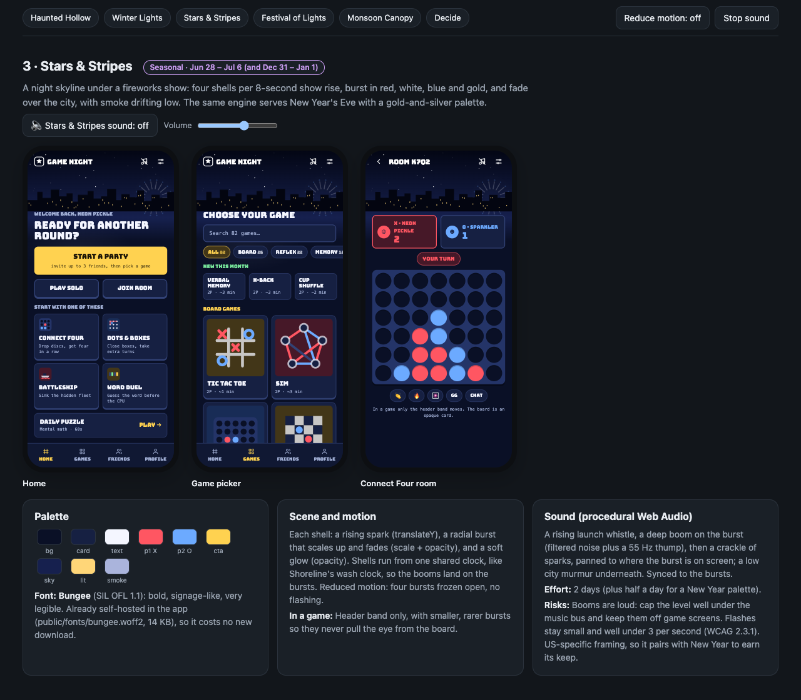 | 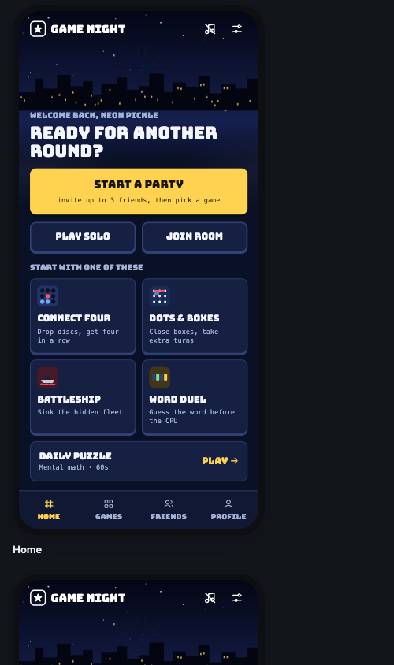 |

- **Palette.** bg `10 16 38`, card `22 32 66`, text `244 246 255`, red X `255 86 98`, blue O `108 170 255`, gold CTA `255 210 80` with dark ink. Scene: sky `3 6 20` to `22 32 78`, city `3 5 16`, lit windows `255 214 120`, smoke `170 180 220`, fw1–4 red/white/blue/gold.
- **Font.** Bungee (SIL OFL 1.1), already self-hosted at `public/fonts/bungee.woff2` (14 KB), so no new download.
- **Scene.** An 8 s show of four shells (`FIREWORKS_PERIOD`, `FIREWORKS_SHOW` in the template). Each shell has a rising spark (translateY), a radial burst of 18 rays that scales up and fades (scale + opacity), and a soft glow (opacity). Every shell runs from one shared epoch so the booms land on the bursts. In the app this belongs in a `fireworksLogic.js` mirroring `beachLogic.js`, so the timing is tested. A skyline silhouette with lit windows and low drifting smoke.
- **Reduced motion.** Four bursts frozen open, no flashing.
- **In a game.** Header band only, with smaller, rarer bursts.
- **Sound.** Per shell: a triangle-wave launch whistle gliding 500 to 1700 Hz with a noise hiss, a boom (low-passed brown noise plus a 70 to 38 Hz thump), and a 26-spark crackle, each panned by the shell's x position. A low city murmur underneath. Source: `AMBIENCES.fireworks`.
- **Effort.** 2 days, plus half a day for the New Year palette.
- **Risks.** Loudness: cap the booms well under the music bus and keep them off game screens. Photosensitivity: flashes stay small and under 3 per second (WCAG 2.3.1). US-specific framing, which is why it pairs with New Year.

## 4. Festival of Lights (Diwali)

**Seasonal, about 10 days around Diwali** (2026: Oct 29 – Nov 11). Chosen as a global pick because the store already prices in INR, so India is a real audience, and Diwali is the biggest festival of lights. Festive rather than devotional (no deity imagery).

| Desktop board | Phone width |
|---|---|
| 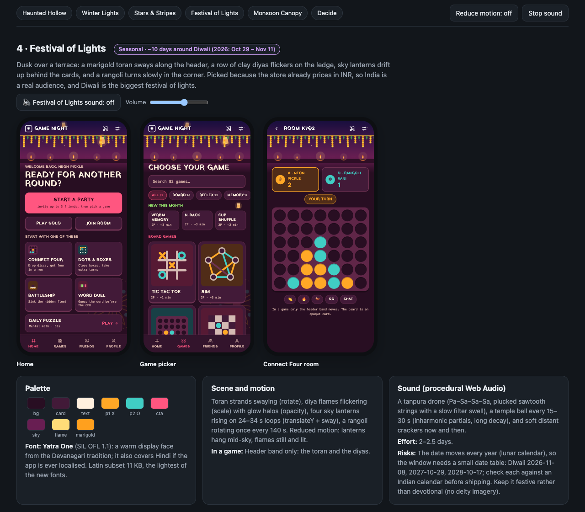 | 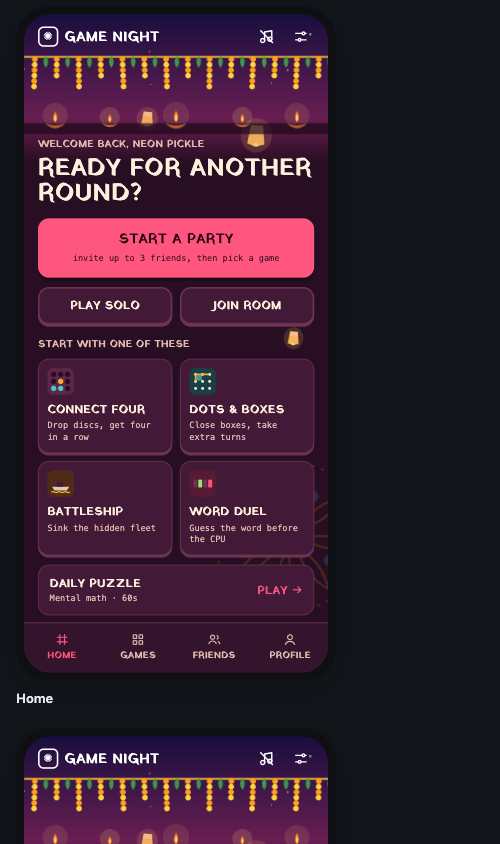 |

- **Palette.** bg `40 14 34`, card `66 26 56`, text `255 240 222`, marigold X `255 168 38`, peacock O `64 206 196`, rani-pink CTA `255 86 128`. Scene: sky `24 14 62` to `104 30 82`, clay `186 92 52`, flame `255 220 120` / `255 128 40`, marigold `255 160 30` / `255 212 60`, leaf `64 150 72`, lantern `255 186 96`.
- **Font.** Yatra One (SIL OFL 1.1), 11 KB latin, the lightest of the new fonts. It also covers Devanagari if the app is ever localised.
- **Scene.** Toran strands with mango leaves swaying (rotate). Five clay diyas on a ledge with flickering flames (scale) and glow halos (opacity). Four sky lanterns rising on 24–34 s loops with sway (translateY). A rangoli in the corner turning once every 140 s.
- **Reduced motion.** Lanterns hang mid-sky, flames still and lit.
- **In a game.** Header band only: the toran and the diyas.
- **Sound.** A tanpura drone (Pa–Sa'–Sa'–Sa on Sa = C3, one string every 1.15 s; detuned sawtooth pairs through a swelling band-pass, like the jawari buzz). A temple bell every 15–30 s (partials ×1, 2.01, 2.76, 5.4, 8.93, ringing up to 4.5 s). Soft distant crackers every 20–40 s. Source: `AMBIENCES.diwali`.
- **Effort.** 2–2.5 days.
- **Risks.** The date moves every year (lunar calendar), so the window needs a date table: Diwali 2026-11-08, 2027-10-29, 2028-10-17. Check each against an Indian calendar before shipping.

## 5. Monsoon Canopy

**Evergreen; promote during the monsoon (Jun – Sep).** Chosen as the evergreen global pick: calm, universal, the richest procedural soundscape of the five, and a light daytime partner for Shoreline. Also considered: Aurora night (pretty, but no characteristic sound) and Cherry Blossom (overlaps the existing SAKURA palette; adding falling petals to SAKURA would be a cheap follow-up).

| Desktop board | Phone width |
|---|---|
| 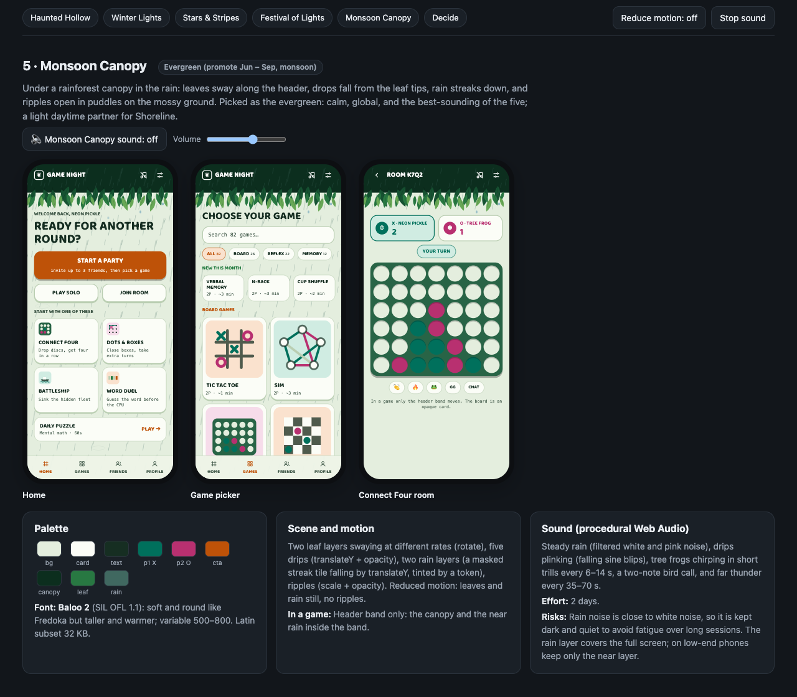 | 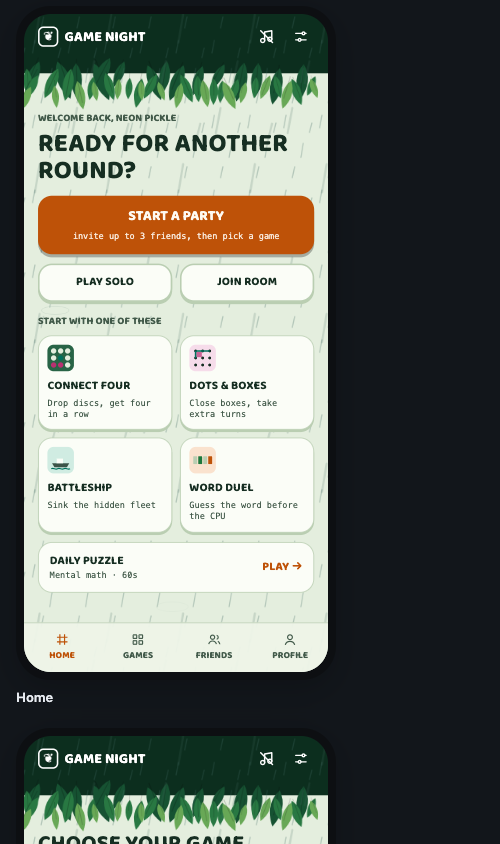 |

- **Palette.** bg `228 238 222`, card `251 253 247`, text `22 46 34`, jungle-teal X `0 112 92`, orchid O `184 48 112`, toucan-orange CTA `190 82 8` with white ink. Scene: canopy `12 46 30`, leaves `22 82 50` / `40 120 66` / `104 168 86`, rain `64 104 96`, drop `120 170 190`.
- **Font.** Baloo 2 (SIL OFL 1.1, variable 500–800), 32 KB latin. Soft and round like Fredoka, but taller and warmer.
- **Scene.** Two leaf layers swaying at 6 and 8 s (rotate). Five drips falling from leaf tips (translateY + opacity). Two rain layers: a masked streak tile falling by translateY, tinted by `--c-rain` so it recolours with the theme. Six puddle ripples (scale + opacity).
- **Reduced motion.** Leaves and rain still, no ripples.
- **In a game.** Header band only: the canopy and the near rain inside the band.
- **Sound.** Rain from band-passed white noise (hiss) and low-passed pink noise (body). Drip plinks (sine blips falling to 0.55×). Tree-frog trills (sawtooth through a narrow band-pass, 3–7 pulses, twice) every 6–14 s. A two-note bird call every 10–20 s. Far thunder every 35–70 s. Source: `AMBIENCES.canopy`.
- **Effort.** 2 days.
- **Risks.** Rain is close to white noise, so keep it dark and quiet to avoid fatigue in long sessions. On low-end phones keep only the near rain layer.

---

## Notes and limits

- Mix levels were never checked by ear. The prototype levels are a starting point; compare against Shoreline's `LEVEL = 0.55` before shipping.
- Font sizes are the latin subsets from Google Fonts (fetched 2026-10-06). All five fonts are SIL OFL 1.1.
- Screenshots were captured from the prototype in headless Chrome at 1280 px (desktop) and 390 px wide (phone). Animations are mid-cycle, so each still shows one moment of the scene.

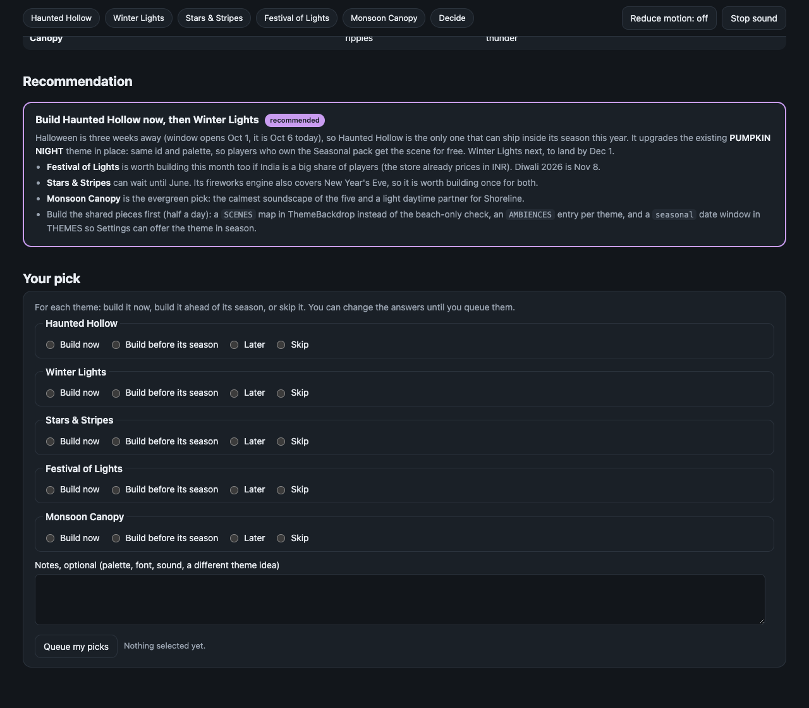
